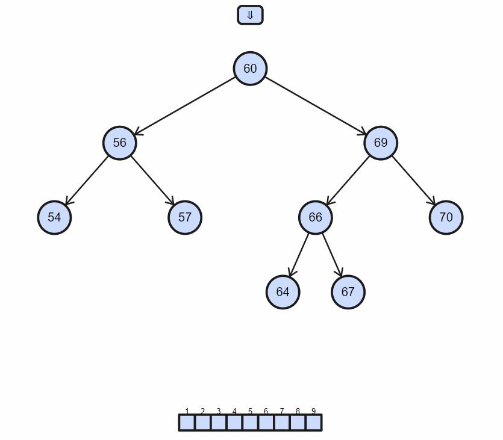
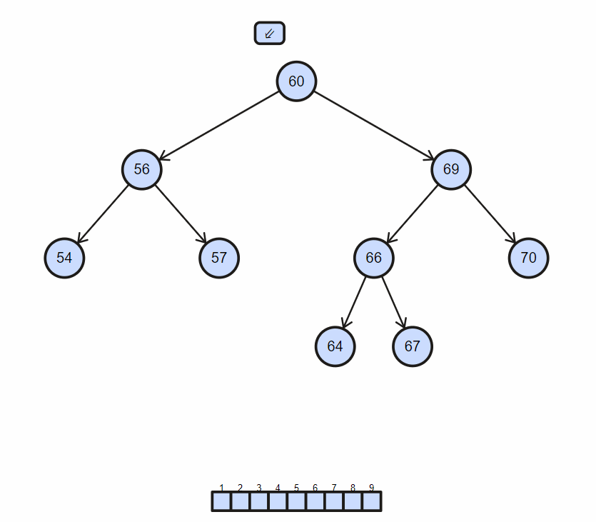

## Table of contents

## 113. 多维数组 flatten

1. `Array.prototype.flat` (ES2019)

   ```js
   const flattenArr = array.flat(Infinity);
   ```

2. 递归

   ```js
   function flatten(array = []) {
     let res = [];
     for (const item of array) {
       if (Array.isArray(item)) {
         res = res.concat(flatten(item));
       } else {
         res.push(item);
       }
     }
   }
   ```

3. 迭代

   ```js
   function flatten(array = []) {
     let res = [];
     let stack = [...array];
     while (stack.length) {
       let item = stack.pop();
       if (Array.isArray(item)) {
         stack.push(...item);
       } else res.unshift(item);
     }
     return res;
   }
   ```

4. 生成器和递归（ES6）

   ```js
   function flatten(array = []) {
     for (const item of array) {
       if (Array.isArray(item)) {
         yield * flatten(item);
       } else {
         yield item
       }
     }
   }
   ```

5. reduce

   ```js
   function flatten(array = []) {
     return array.reduce((acc, item) => {
       return acc.concat(Array.isArray(item) ? flatten(item) : item);
     }, []);
   }
   ```

## 114. 找到页面所有 a 标签的 href 属性

```js
const res = [...document.getElementsByTagName("a")].map(i => i.href);
```

## 115. 如何给按钮绑定两个事件

```js
const btn = document.querySelector("button");

function handleClick1() {
  console.log("click 1");
}
function handleClick2() {
  console.log("click 2");
}

btn.addEventListener("click", handleClick1);
btn.addEventListener("click", handleClick2);
```

## 116. 拖拉拽功能

> 详见 [元素拖拉](#81-元素拖动)

## 117. 原地打乱数组（数组洗牌）

```js
function shuffleArrar(array) {
  for (let i = array.length - 1; i > 0; i--) {
    const j = Math.floor(Math.random() * i);
    [array[i], array[j]] = [array[j], array[i]];
  }
  return array;
}

const arr = [1, 2, 3, 4, 5];

console.log(shuffleArrar(arr));
```

## 118. 不能用 `Array.sort` 方法来打乱数组的原因

1. **排序算法的稳定性**：相等元素的相对顺序不会改变，这进一步降低了 `sort` 方法的随机性。

2. **效率问题**：`Array.sort` 的时间复杂度通常为 `O(nlogn)`，而 Fisher-Yates 洗牌算法的时间复杂度为 `O(n)`。因此，使用 `Array.sort` 进行随机打乱在效率上也不如 Fisher-Yates 洗牌算法。

```javascript
const arr = [1, 2, 3, 4, 5];
const shuffledArr = arr.sort(() => Math.random() - 0.5);
console.log(shuffledArr);
```

多次运行以上代码，会发现输出的结果并不总是完全随机的，有时会出现某些特定的排列频率更高的情况

## 119. 对象深拷贝

在 JavaScript 中，进行对象深拷贝的方法有多种。以下是几种常用的方法：

1. 使用 JSON.stringify 和 JSON.parse

这种方法适用于对象中只包含可序列化的数据类型（如不含函数、`undefined`、循环引用等）。

```javascript
const original = { a: 1, b: { c: 2 } };
const copy = JSON.parse(JSON.stringify(original));
console.log(copy); // { a: 1, b: { c: 2 } }
```

2. 使用递归方式进行深拷贝

这种方法适用于更复杂的数据类型，包括循环引用和函数。

```javascript
function deepClone(obj, hash = new WeakMap()) {
  if (Object(obj) !== obj) return obj; // 原始值
  if (hash.has(obj)) return hash.get(obj); // 循环引用

  let result;
  if (obj instanceof Date) {
    result = new Date(obj);
  } else if (obj instanceof RegExp) {
    result = new RegExp(obj.source, obj.flags);
  } else if (obj instanceof Map) {
    result = new Map(
      Array.from(obj, ([key, val]) => [
        deepClone(key, hash),
        deepClone(val, hash),
      ])
    );
  } else if (obj instanceof Set) {
    result = new Set(Array.from(obj, val => deepClone(val, hash)));
  } else if (Array.isArray(obj)) {
    result = obj.map(item => deepClone(item, hash));
  } else if (typeof obj === "object") {
    result = Object.create(Object.getPrototypeOf(obj));
    hash.set(obj, result);
    for (let key of Reflect.ownKeys(obj)) {
      result[key] = deepClone(obj[key], hash);
    }
  }

  return result;
}

const original = { a: 1, b: { c: 2 }, d: new Date(), e: /abc/g };
const copy = deepClone(original);
console.log(copy);
```

3. 使用库 Lodash 的 `cloneDeep` 方法

4. 使用结构化克隆算法（Structured Clone）

浏览器提供了 `structuredClone` 方法，可以进行深拷贝。注意此方法不支持 Node.js

```javascript
const original = { a: 1, b: { c: 2 } };
const copy = structuredClone(original);
console.log(copy); // { a: 1, b: { c: 2 } }
```

## 120. curry function

```js
const curry = func => {
  return (...args) => {
    if (args.length >= func.length) {
      console.log("a", args, func, args.length, func.length);
      return func(...args);
    } else {
      console.log("b", args, func, args.length, func.length);
      return (...nextArgs) => {
        console.log("c", args, func, args.length, func.length);
        return curry(func)(...args, ...nextArgs);
      };
    }
  };
};

// 示例函数
function sum(a, b, c) {
  return a + b + c;
}

const curriedSum = curry(sum);

console.log(curriedSum(1)(2)(3)); // 6
```

## 121. 字符串反转

```js
const str = "abcdefg";

const reverseStr1 = str.split("").reverse().join("");

const reverseStr2 = Array.from(str).reduce((pre, cur) => `${cur}${pre}`, "");
```

## 122. 实现防抖

<details>
<summary>
定义
</summary>
触发事件后，设置一个定时器
若指定时间内再触发了事件，清除之前的定时器，并设置新的定时器
若指定之间后触发了事件，则触发
</details>

```js
const myDebounce = (fn, delay = 3000) => {
  let timer = null;
  return (...args) => {
    if (timer) clearTimeout(timer);
    timer = setTimeout(() => {
      fn(args);
      timer = null;
    }, delay);
  };
};
```

## 123. 实现节流

<details>
<summary>
定义
</summary>
触发事件后，
再固定的时间间隔内执行
</details>

```js
const myThrottle = (fn, delay = 3000) => {
  let timer = null;
  return (...args) => {
    if (timer) return;
    timer = setTimeout(() => {
      fn(...args);
      timer = null;
    }, delay);
  };
};
```

## 124. 实现一个方法，能上传多张图片，保持单次 n 长上传，n 张里如果有一张成功，就补上 1 张，一直维持 n 张图片同时在上传

```js
const srcs = [...Array(50).keys()].map(i => `https://${i}.png`);

const uploadImg = url => {
  return new Promise(resolve => {
    console.log(`%c 开始${url}`, "color:#00f;");
    setTimeout(() => {
      resolve(url);
      console.log(`成功${url}`);
    }, 3000 * Math.random());
  });
};

const warpRequest = urls => {
  const resultMap = {};
  urls.forEach(element => {
    resultMap[element] = false;
  });

  let index = 0;

  return new Promise(resolve => {
    const download = () => {
      // 跳出条件
      if (index >= urls.length) {
        if (!Object.keys(resultMap).find(key => resultMap[key] === false)) {
          resolve(resultMap);
        }
        return;
      }
      // 上传
      const tempUrl = urls[index];
      uploadImg(tempUrl).then(res => {
        resultMap[tempUrl] = res;
        setTimeout(() => {
          download();
        }, 100);
      });
      // 计数器++
      ++index;
    };
    while (index < 5) {
      download();
    }
  });
};

(async () => {
  const result = await warpRequest(srcs);
  console.log(result);
})();
```

## 125. 获取当前时间

```js
/**
 *
 * @param {Date} date
 * @returns
 */
function formatDate(date) {
  const year = date.getFullYear();
  const month = (date.getMonth() + 1).toString().padStart(2, "0");
  const day = date.getDate().toString().padStart(2, "0");
  const hour = date.getHours().toString().padStart(2, "0");
  const minute = date.getMinutes().toString().padStart(2, "0");
  const second = date.getSeconds().toString().padStart(2, "0");

  return `${year}-${month}-${day} ${hour}:${minute}:${second}`;
}

console.log(formatDate(new Date()));
```

## 126. once 函数，传入函数只执行一次

```js
/**
 *
 * @param {Function} fn
 * @returns {Function}
 */
function once(fn) {
  let called = false;
  return function (...args) {
    if (called) return;
    called = true;
    return fn(...args);
  };
}

const fn1 = once(function () {
  console.log("hahaha");
});

fn1(); // hahaha
fn1(); // 不会执行
```

## 127. 实现一个私有变量，可用 `get`,`set`访问，不可直接访问

在 JavaScript 中，可以使用闭包或 ES6 的 `WeakMap` 来实现私有变量。以下是两种方法的示例：

**方法 1：使用闭包**

通过闭包，我们可以创建一个私有变量，并通过 `get` 和 `set` 方法访问它：

```javascript
function createPerson(name) {
  let _name = name; // 私有变量

  return {
    getName() {
      return _name;
    },
    setName(newName) {
      if (typeof newName === "string" && newName.length > 0) {
        _name = newName;
      } else {
        throw new Error("Invalid name");
      }
    },
  };
}

const person = createPerson("John");
console.log(person.getName()); // John
person.setName("Doe");
console.log(person.getName()); // Doe
// person._name; // undefined, 无法直接访问
```

**方法 2：使用 ES6 `WeakMap`**

`WeakMap` 提供了一种更强大的方式来实现私有变量，它允许你将私有数据存储在对象外部，从而避免直接访问：

```javascript
const Person = (function () {
  const privateData = new WeakMap();

  class Person {
    constructor(name) {
      privateData.set(this, { name: name });
    }

    getName() {
      return privateData.get(this).name;
    }

    setName(newName) {
      if (typeof newName === "string" && newName.length > 0) {
        privateData.get(this).name = newName;
      } else {
        throw new Error("Invalid name");
      }
    }
  }

  return Person;
})();

const person = new Person("John");
console.log(person.getName()); // John
person.setName("Doe");
console.log(person.getName()); // Doe
// person.name; // undefined, 无法直接访问
```

1. 闭包：**私有变量**: `_name` 被封闭在 `createPerson` 函数的作用域中，因此外部无法直接访问它。
2. WeekMap：**私有变量**: `WeakMap` 用于存储私有数据，每个实例对象作为 `WeakMap` 的键，私有数据作为值。

## 128. 将原生的 ajax 封装成 Promise

```js
/**
 *
 * @param {String} url
 * @param String method
 * @param String data
 * @returns {Promise}
 */
function ajax(url, method, data) {
  return new Promise((resolve, reject) => {
    const xhr = new XMLHttpRequest();
    xhr.open(method, url, true);
    xhr.onload = () => {
      if (xhr.status >= 200 && xhr.status < 300) {
        resolve(xhr.responseText);
      } else {
        reject(xhr.statusText);
      }
    };

    xhr.onerror = () => {
      reject(xhr.statusText);
    };

    if (data) {
      xhr.setRequestHeader("Content-Type", "application/json;charset=TF-9");
      xhr.send(JSON.stringify(data));
    } else {
      xhr.send();
    }
  });
}

ajax("https://xbank.global/launchpad/api/v1/airdrops/projects", "GET")
  .then(console.log)
  .catch(console.log);
```

## 129. 实现 sleep

```js
function sleep(ms = 3000) {
  return new Promise(r => {
    setTimeout(() => {
      r();
    }, md);
  });
}
```

## 130. 下载图片

```js
function downloadImg(src, title) {
  let img = new Image();
  img.src = src;
  img.setAttribute("crossOrigin", "anonymous");
  img.onload = () => {
    let ele = document.createElement("canvas");
    ele.width = img.width;
    ele.height = img.height;
    let a = document.createElement("a");
    a.download = title;
    a.href = ele.toDataURL("image/png");
    a.click();
  };
}
```

## 131. 响应式数据+依赖收集 -- pending

## 132. 实现 instanceOf

```js
function instanceOf(obj, constructor) {
  // 如果 obj 是 null，直接返回 false
  if (obj === null) {
    return false;
  }

  // 获取 obj 的原型
  let proto = Object.getPrototypeOf(obj);

  // 遍历原型链
  while (proto !== null) {
    // 检查当前原型是否等于 constructor 的 prototype 属性
    if (proto === constructor.prototype) {
      return true;
    }
    // 继续向上查找原型链
    proto = Object.getPrototypeOf(proto);
  }

  // 如果遍历到原型链的末端仍未找到，返回 false
  return false;
}

// 测试示例
function Person(name) {
  this.name = name;
}

const john = new Person("John");

console.log(instanceOf(john, Person)); // true
console.log(instanceOf(john, Object)); // true
console.log(instanceOf(john, Array)); // false
```

1. **获取构造函数的 `prototype` 属性**：这是我们需要在对象的原型链中查找的属性。
2. **遍历对象的原型链**：使用 `while (obj != null)` 遍历对象的原型链。
3. **检查原型链**：在每一步中，检查当前对象的 `__proto__` 属性是否与构造函数的 `prototype` 属性相同。如果相同，返回 `true`；如果不相同，继续沿着原型链向上查找。

## 133. 还原一棵树

假设我们有一个扁平化的节点数组，每个节点包含 `id` 和 `parentId` 字段：

```javascript
const data = [
  { id: 1, parentId: null, name: "Root" },
  { id: 2, parentId: 1, name: "Child 1" },
  { id: 3, parentId: 1, name: "Child 2" },
  { id: 4, parentId: 2, name: "Child 1.1" },
  { id: 5, parentId: 2, name: "Child 1.2" },
  { id: 6, parentId: 3, name: "Child 2.1" },
];
```

```js
function buildTree(data) {
  const idMap = {};
  const tree = [];

  // 创建一个映射表
  data.forEach(node => {
    idMap[node.id] = { ...node, children: [] };
  });

  // 遍历数据并构建树
  data.forEach(node => {
    if (node.parentId === null) {
      // 根节点
      tree.push(idMap[node.id]);
    } else {
      // 非根节点，添加到其父节点的 children 数组中
      idMap[node.parentId].children.push(idMap[node.id]);
    }
  });

  return tree;
}

const tree = buildTree(data);
console.log(JSON.stringify(tree, null, 2));
```

1. **创建映射表**: 使用 `idMap` 将每个节点的 `id` 映射到节点本身，同时在每个节点中添加一个 `children` 数组，用于存放子节点。
2. **构建树**: 遍历每个节点，如果节点是根节点（`parentId` 为 `null`），将其添加到树的根节点数组中。否则，将其添加到其父节点的 `children` 数组中。
3. **返回树**: 函数返回树的根节点数组。

```json
[
  {
    "id": 1,
    "parentId": null,
    "name": "Root",
    "children": [
      {
        "id": 2,
        "parentId": 1,
        "name": "Child 1",
        "children": [
          {
            "id": 4,
            "parentId": 2,
            "name": "Child 1.1",
            "children": []
          },
          {
            "id": 5,
            "parentId": 2,
            "name": "Child 1.2",
            "children": []
          }
        ]
      },
      {
        "id": 3,
        "parentId": 1,
        "name": "Child 2",
        "children": [
          {
            "id": 6,
            "parentId": 3,
            "name": "Child 2.1",
            "children": []
          }
        ]
      }
    ]
  }
]
```

## 134. 一只青蛙可以跳 1 级台阶，也可以跳 2 级台阶，问该青蛙跳上 n 级台阶总共有多少种跳法

这是一个经典的动态规划问题，类似于斐波那契数列。青蛙跳上第 n 级台阶的跳法数可以表示为前两级台阶跳法数之和。

我们可以通过以下公式来表示这个问题：

- 当 n = 1 时，只有一种跳法，即跳 1 级。
- 当 n = 2 时，有两种跳法：跳 1 级 + 1 级，或直接跳 2 级。
- 当 n > 2 时，跳上第 n 级台阶的跳法数等于跳上第 (n-1) 级台阶和第 (n-2) 级台阶的跳法数之和。

公式可以表示为：
\[ f(n) = f(n-1) + f(n-2) \]

以下是使用 JavaScript 实现该问题的几种方法：递归、记忆化递归和动态规划。

1. 方法 1：递归

递归方法最直接，但当 n 较大时效率较低。

```javascript
function climbStairs(n) {
  if (n === 1) return 1;
  if (n === 2) return 2;
  return climbStairs(n - 1) + climbStairs(n - 2);
}

console.log(climbStairs(10)); // 输出 89
```

2. 方法 2：记忆化递归

记忆化递归通过缓存中间结果来提高效率。

```javascript
function climbStairs(n, memo = {}) {
  if (n === 1) return 1;
  if (n === 2) return 2;
  if (memo[n]) return memo[n];
  memo[n] = climbStairs(n - 1, memo) + climbStairs(n - 2, memo);
  return memo[n];
}

console.log(climbStairs(10)); // 输出 89
```

3. 方法 3：动态规划

动态规划方法通过迭代计算来避免递归的开销，效率更高。

```javascript
function climbStairs(n) {
  if (n === 1) return 1;
  if (n === 2) return 2;
  let prev1 = 1,
    prev2 = 2;
  for (let i = 3; i <= n; i++) {
    let current = prev1 + prev2;
    prev1 = prev2;
    prev2 = current;
  }
  return prev2;
}

console.log(climbStairs(10)); // 输出 89
```

4. 方法 4：更简单的动态规划（数组形式）

这种方法更直观，但空间复杂度稍高。

```javascript
function climbStairs(n) {
  if (n === 1) return 1;
  if (n === 2) return 2;
  const dp = [0, 1, 2];
  for (let i = 3; i <= n; i++) {
    dp[i] = dp[i - 1] + dp[i - 2];
  }
  return dp[n];
}

console.log(climbStairs(10)); // 输出 89
```

## 135. 找出字符串中不含有重复字符的最长子串

```javascript
function longestUniqueSubstring(s) {
  let map = new Map();
  let left = 0;
  let maxLength = 0;
  let start = 0; // 记录最长子串的起始位置

  for (let right = 0; right < s.length; right++) {
    if (map.has(s[right])) {
      left = Math.max(map.get(s[right]) + 1, left);
    }
    map.set(s[right], right);

    if (right - left + 1 > maxLength) {
      maxLength = right - left + 1;
      start = left;
    }
  }

  return s.substring(start, start + maxLength);
}

// 示例
let s = "abcabcbb";
console.log(longestUniqueSubstring(s)); // 输出："abc"
```

### 136. 回文判断

我的笨办法 😅

```js
function canPermutePalindrome(str) {
  const arr = str.split("");
  if (arr.length < 1) return false;
  let res = true;
  while (arr.length > 1) {
    if (arr[0] === arr[arr.length - 1]) {
      arr.shift();
      arr.pop();
    } else {
      res = false;
      break;
    }
  }
  return res;
}

console.log(fn("aabbaa"));
```

另一思路 😮

```js
function canPermutePalindrome(str) {
  const arr = str.split("");
  const set = new Set();
  arr.forEach(key => {
    if (set.has(key)) {
      set.delete(key);
    } else {
      set.add(key);
    }
  });
  return set.size <= 1;
}

console.log(canPermutePalindrome("abddbq"));
```

## 137. 反转一个链表

```javascript
class ListNode {
  constructor(val = 0, next = null) {
    this.val = val;
    this.next = next;
  }
}

function reverseList(head) {
  let prev = null;
  let curr = head;

  while (curr !== null) {
    let next = curr.next;
    curr.next = prev;
    prev = curr;
    curr = next;
  }

  return prev;
}

// Helper function to create a linked list from an array
function createLinkedList(arr) {
  let head = null;
  let tail = null;

  for (let val of arr) {
    let newNode = new ListNode(val);
    if (tail === null) {
      head = newNode;
      tail = newNode;
    } else {
      tail.next = newNode;
      tail = newNode;
    }
  }

  return head;
}

// Helper function to convert a linked list to an array
function linkedListToArray(head) {
  let arr = [];
  let current = head;

  while (current !== null) {
    arr.push(current.val);
    current = current.next;
  }

  return arr;
}

// Example usage:
let list = createLinkedList([1, 2, 3, 4, 5]);
console.log("Original list:", linkedListToArray(list));
let reversedList = reverseList(list);
console.log("Reversed list:", linkedListToArray(reversedList));
```

## 138. 遍历二叉树

1. 前序遍历 **根 左 右**
   

2. 中序遍历 **左 根 右**
   

3. 后序遍历 **左 右 根**
   

```javascript
class TreeNode {
  constructor(val = 0, left = null, right = null) {
    this.val = val;
    this.left = left;
    this.right = right;
  }
}

// 前序遍历 (Pre-order traversal)
function preOrderTraversal(root) {
  let result = [];
  function traverse(node) {
    if (node !== null) {
      result.push(node.val); // 访问节点
      traverse(node.left); // 递归遍历左子树
      traverse(node.right); // 递归遍历右子树
    }
  }
  traverse(root);
  return result;
}

// 中序遍历 (In-order traversal)
function inOrderTraversal(root) {
  let result = [];
  function traverse(node) {
    if (node !== null) {
      traverse(node.left); // 递归遍历左子树
      result.push(node.val); // 访问节点
      traverse(node.right); // 递归遍历右子树
    }
  }
  traverse(root);
  return result;
}

// 后序遍历 (Post-order traversal)
function postOrderTraversal(root) {
  let result = [];
  function traverse(node) {
    if (node !== null) {
      traverse(node.left); // 递归遍历左子树
      traverse(node.right); // 递归遍历右子树
      result.push(node.val); // 访问节点
    }
  }
  traverse(root);
  return result;
}

// Example usage:
let tree = new TreeNode(1);
tree.right = new TreeNode(2);
tree.right.left = new TreeNode(3);

console.log("Pre-order traversal:", preOrderTraversal(tree)); // [1, 2, 3]
console.log("In-order traversal:", inOrderTraversal(tree)); // [1, 3, 2]
console.log("Post-order traversal:", postOrderTraversal(tree)); // [3, 2, 1]
```

## 139. 实现一个全排列

```javascript
/**
 *
 * @param {number[]} nums
 * @returns
 */
function permute(nums) {
  let result = [];
  /**
   *
   * @param {number[]} subArr
   * @param {number[]} remains
   * @returns
   */
  function backtrack(subArr, remains) {
    if (remains.length === 0) {
      result.push([...subArr]);
      return;
    }

    for (let i = 0; i < remains.length; i++) {
      subArr.push(remains[i]);
      const newRemain = [...remains.slice(0, i), ...remains.slice(i + 1)];
      backtrack(subArr, newRemain);
      subArr.pop();
    }
  }

  backtrack([], nums);
  return result;
}

console.log(permute([1, 2, 3]));

// Example usage:
let nums = [1, 2, 3];
console.log("Permutations:", permute(nums));
// Output:
// [
//   [1, 2, 3],
//   [1, 3, 2],
//   [2, 1, 3],
//   [2, 3, 1],
//   [3, 1, 2],
//   [3, 2, 1]
// ]
```

## 140. 快速找到链表中间节点

快慢指针，快指针步数为 2，慢指针步数为 1，两个指针同时启动，当快指针走到底，慢指针指向的即为中间节点

```javascript
class ListNode {
  constructor(val = 0, next = null) {
    this.val = val;
    this.next = next;
  }
}

function findMiddle(head) {
  let slow = head;
  let fast = head;

  while (fast !== null && fast.next !== null) {
    slow = slow.next;
    fast = fast.next.next;
  }

  return slow;
}

// 示例链表：1 -> 2 -> 3 -> 4 -> 5
let node5 = new ListNode(5);
let node4 = new ListNode(4, node5);
let node3 = new ListNode(3, node4);
let node2 = new ListNode(2, node3);
let head = new ListNode(1, node2);

let middle = findMiddle(head);
console.log("Middle node value:", middle.val); // 输出：Middle node value: 3
```
