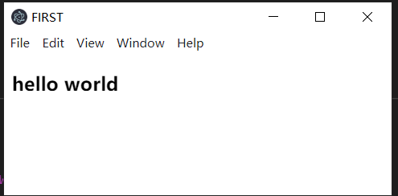
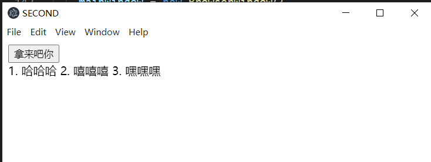
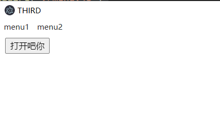

Electron 是一个能让你使用 JavaScript, HTML 和 CSS 来创建桌面应用程序的框架。 这些应用程序可以打包后在 macOS、Windows 和 Linux 上直接运行，或者通过 Mac App Store 或微软商店进行分发。

通常，你可以使用操作系统 (OS) 特定的本地应用程序框架来创建一个桌面应用程序。 Electron 可以使用你了解的技术来编写应用程序。

Electron = Chromium + Node.js + Native API

### 安装 Electron

为您的项目创建一个文件夹并安装 Electron：

```
mkdir my-electron-app && cd my-electron-app
npm init -y
npm i --save-dev electron
```

### electron 热更新/热加载

1. 安装 `electron-reloader`

`npm install electron-reloader --save-dev`

2. 在主进程 js 文件（main.js）加入如下代码：

```js
try {
  require("electron-reloader")(module);
} catch (_) {}
```

3. 重启测试，更改 js css html 等文件都能自动加载更新 electron

### 第一个 hello world

1. 新建一个 index.html

```html
<!doctype html>
<html lang="en">
  <head>
    <meta charset="UTF-8" />
    <meta http-equiv="X-UA-Compatible" content="IE=edge" />
    <meta name="viewport" content="width=device-width, initial-scale=1.0" />
    <title>FIRST</title>
  </head>

  <body>
    <h3>hello world</h3>
  </body>
</html>
```

2. 新建一个 main.js: 主进程文件

```js
// 引入 electron 模块
const { app, BrowserWindow } = require("electron");
let mainWindow = null;
app.whenReady().then(() => {
  // 新建窗口，宽高为 200*200
  mainWindow = new BrowserWindow({ width: 400, height: 200 });
  // 加载 index.html
  mainWindow.loadFile("index.html");
  // 监听关闭事件，把主窗口设置为 null
  mainWindow.on("closed", () => {
    console.log("closed");
    mainWindow = null;
  });
});
```

这时候打开终端，在终端里输入`electron .`就可以打开窗口了。


**注意：**检查 package.json，main 必须为主进程文件：main.js.（默认为 index.js)

附：文件结构

- node_modules
- index.html
- main.js
- package.json
- package-lock.json

或者

```sh
git clone https://github.com/electron/electron-quick-start
# Go into the repository
cd electron-quick-start
# Install dependencies
npm install
# Run the app
npm start
```

### 读取文件栗子

1. 新建一个 data.md

```md
1. 哈哈哈
2. 嘻嘻嘻
3. 嘿嘿嘿
```

2. 改写 index.html

```html
<!doctype html>
<html lang="en">
  <head>
    <meta charset="UTF-8" />
    <meta http-equiv="X-UA-Compatible" content="IE=edge" />
    <meta name="viewport" content="width=device-width, initial-scale=1.0" />
    <title>SECOND</title>
  </head>

  <body>
    <button id="btn">拿来吧你</button>
    <div id="wrapper"></div>
  </body>
</html>
```

3. 新建 renderer 文件夹，在 renderer 文件夹下新建一个 index.js

```js
const fs = require("fs");

window.onload = () => {
  const btn = document.querySelector("#btn");
  const wrapper = document.querySelector("#wrapper");
  btn.onclick = () => {
    fs.readFile("data.md", (error, data) => {
      wrapper.innerHTML = data;
    });
  };
};
```

4. 坑：控制台报错：require is not defined
   改写 main.js

```js
app.on("ready", () => {
  mainWindow = new BrowserWindow({
    webPreferences: {
      nodeIntegration: true,
      contextIsolation: false,
    },
  });
});
```

这时候点击按钮



附：文件结构

- node_modules
- renderer
  - index.js
- index.html
- main.js
- package.json
- package-lock.json

### remote 模块

Electron 有主进程和渲染进程，Electron 的 API 方法和模块也是分为可以在主进程和渲染进程中使用。那如果我们想在渲染进程中使用主进程中的模块方法时，可以使用 Electron Remote 解决在渲染和主进程间的通讯。

1. index.html

```html
<!doctype html>
<html lang="en">
  <head>
    <meta charset="UTF-8" />
    <meta http-equiv="X-UA-Compatible" content="IE=edge" />
    <meta name="viewport" content="width=device-width, initial-scale=1.0" />
    <title>THIRD</title>
  </head>

  <body>
    <button id="btn">打开吧你</button>
    <script src="renderer/demo2.js"></script>
  </body>
</html>
```

2. renderer/demo2.js

```js
const { BrowserWindow } = require("electron").remote;
window.onload = () => {
  const btn = document.querySelector("#btn");
  btn.onclick = () => {
    // 打开新窗口
    let newWindow = new BrowserWindow({
      width: 400,
      height: 200,
    });
    newWindow.loadFile("newWindow.html");
    newWindow.on("closed", () => {
      newWindow = null;
    });
  };
};
```

3. 新建 newWindow.html

```html
<!doctype html>
<html lang="en">
  <head>
    <meta charset="UTF-8" />
    <meta http-equiv="X-UA-Compatible" content="IE=edge" />
    <meta name="viewport" content="width=device-width, initial-scale=1.0" />
    <title>我是新打开的窗口</title>
  </head>

  <body>
    <h2>我是新来的</h2>
  </body>
</html>
```

4. 坑：改写 main.js

```js
const { app, BrowserWindow } = require("electron");
let mainWindow = null;
app.whenReady().then(() => {
  mainWindow = new BrowserWindow({
    width: 600,
    height: 400,
    webPreferences: {
      nodeIntegration: true,
      contextIsolation: false,
      // 需要打开
      enableRemoteModule: true,
    },
  });
  mainWindow.loadFile("index.html");
  mainWindow.on("closed", () => {
    mainWindow = null;
  });
});
```

这时候，点击按钮就可以打开新窗口了
附：文件结构

- node_modules
- renderer
  - index.js
  - demo2.js
- index.html
- newWindow.html
- main.js
- package.json
- package-lock.json

### 菜单基本使用

1. 新建 main 文件夹，将 main.js 移至 main 文件夹下，主进程中用到的代码我们都写到这里
   新建 menu.js

```js
const { Menu, BrowserWindow } = require("electron");

const template = [
  {
    label: "menu1",
    submenu: [
      {
        label: "新建窗口",
        accelerator: `ctrl+n`, // 快捷键
        click: () => {
          var win = new BrowserWindow({
            width: 500,
            height: 500,
            webPreferences: {
              nodeIntegration: true,
            },
          });
          win.loadFile("newWindow.html");
          win.on("closed", () => {
            win = null;
          });
        },
      },
      {
        label: "menu1_2",
      },
    ],
  },
  {
    label: "menu2",
    submenu: [
      {
        label: "menu2_1",
      },
      {
        label: "menu2_2",
      },
      {
        label: "menu2_3",
      },
    ],
  },
];

Menu.setApplicationMenu(Menu.buildFromTemplate(template));
```

2. 在 main.js 中导入 menu.js

```js
const { app, BrowserWindow } = require("electron");

let mainWindow = null;
app.whenReady().then(() => {
  mainWindow = new BrowserWindow({
    width: 600,
    height: 400,
    webPreferences: {
      nodeIntegration: true,
      contextIsolation: false,
      // 需要打开
      enableRemoteModule: true,
    },
  });
  require("./menu.js");
  mainWindow.loadFile("index.html");
  mainWindow.webContents.openDevTools();
  mainWindow.on("closed", () => {
    mainWindow = null;
  });
});
```

如图



附：文件结构

- node_modules
- main
  - main.js
  - menu.js
- renderer
  - index.js
  - demo2.js
- index.html
- newWindow.html
- package.json （注意将主进程文件路径修改为 main/main.js)
- package-lock.json

### 右键菜单

右键菜单的响应事件是写在渲染进程中的，也就是写在 index.html 中的，所以要是使用，就用到到 remote 模块进行操作了。

---

持续更新中...
