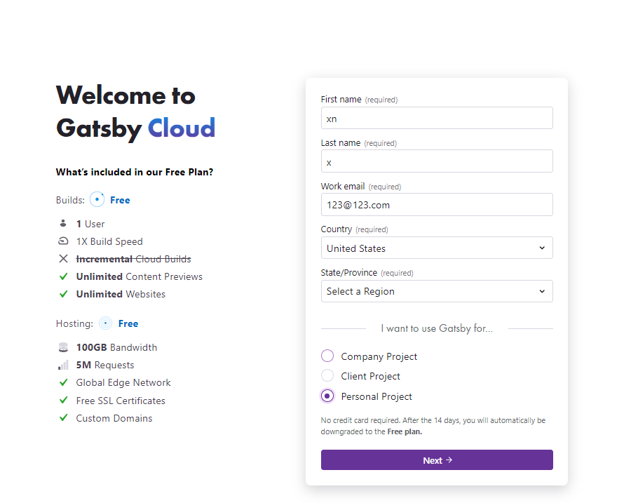
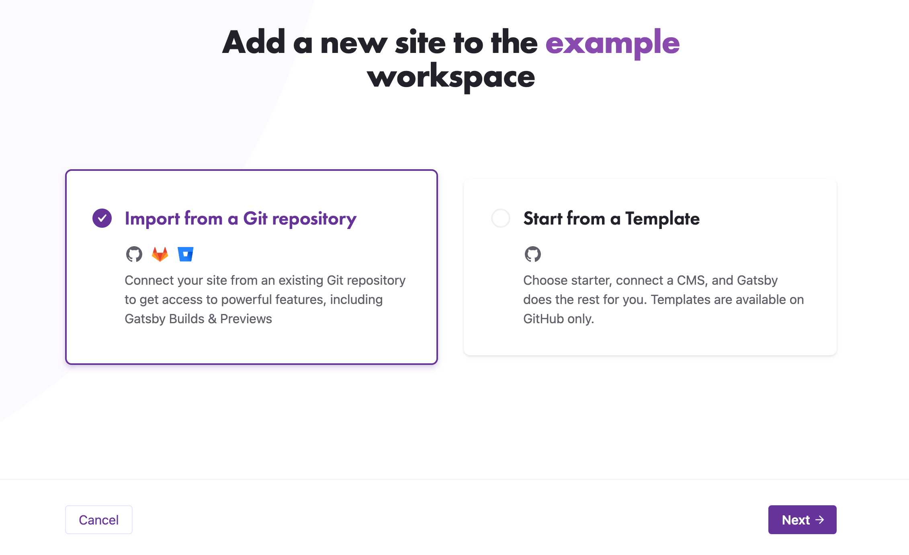
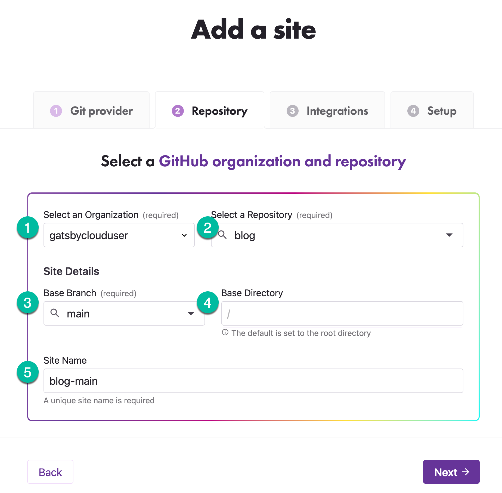
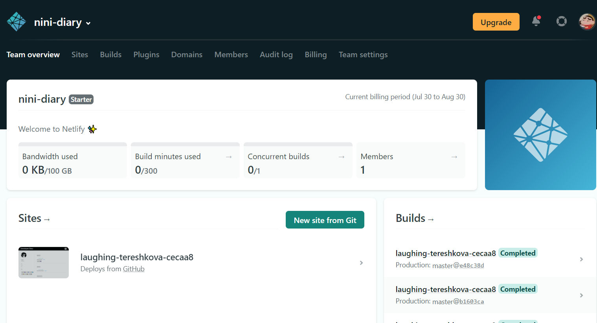
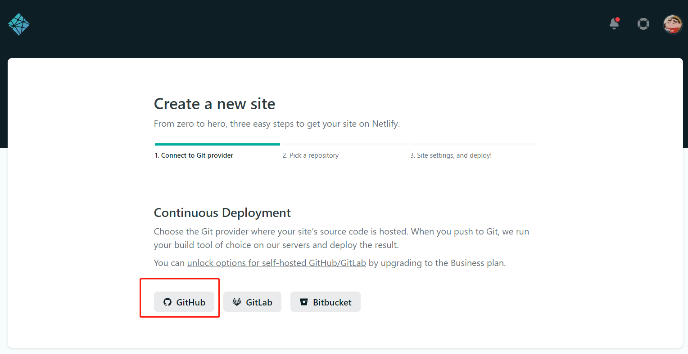
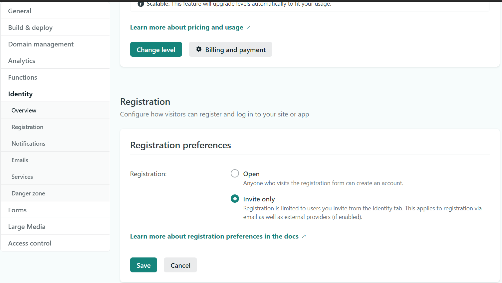
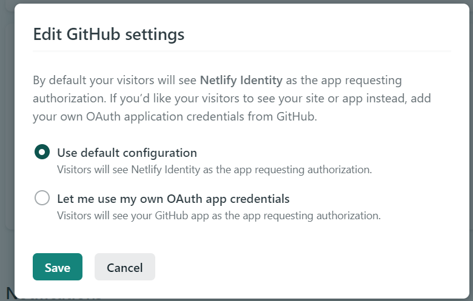
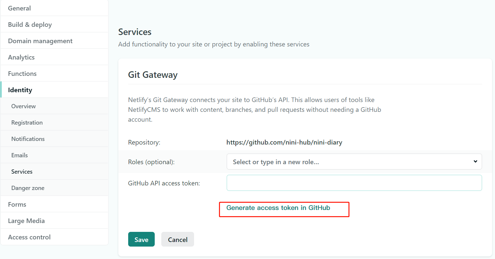
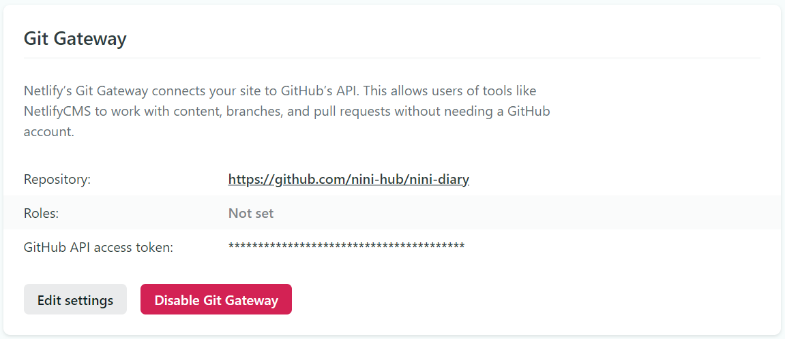
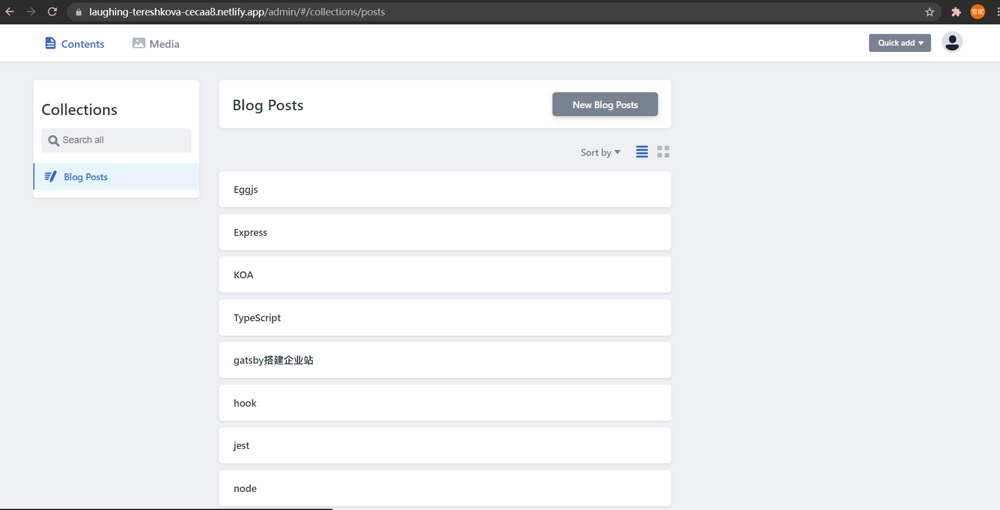

# 注册 gatsby cloud 账户

首先，需要一个带有版本控制系统的帐户。 目前已支持 GitHub 和 Gitlab。

1. 要注册帐户，请访问 [gatsby dashboard](http://gatsbyjs.com/dashboard/signup "dashboard")。 输入名字，姓氏和电子邮件。选择 Personal Project
   

2. 接下来，选择“版本控制系统提供商”按钮的授权。授予访问 Gatsby Cloud 应用程序的访问权限。
   

3. 单击“授权”按钮后，您将重新启动回 Gatsby Cloud，选择 individual
   

4. 进入 dashborder
   

# 已有仓库创建站点

添加新的 Gatsby Cloud 站点有两种流程：

- 从 Template 开始
- 从 git 仓库导入

本文只介绍第二种，由 git 仓库导入

1. 准备仓库
   本文将使用 gatsby-starter-blog。
   `gatsby new my-gatsby-project https://github.com/gatsbyjs/gatsby-starter-blog`
   或者
   `git clone https://github.com/gatsbyjs/gatsby-starter-blog`
   项目初始化完成后，推到你得远程仓库

2. 选择仓库
   从 Gatsby Dashboard 中，单击“add site”按钮。 从 GIT repository 选择导入
   

3. 接下来，选择 GitHub，现已支持 GitHub，Gitlab 和 Bitbucket。
   

4. 完善仓库详情
   

接下来的设置非必需
至此你就得到了一个默认域名 `xxx.gatsbyjs.io`,每一次 push 都会自动部署 `xxx.gatsbyjs.io`

# 使用Netlify CMS 添加博客文章

如果您不熟悉Netlify CMS，您要做的第一件事就是熟悉它。(Netlify CMS) (https://www.netlifycms.org/)

首先需要安装`gatsby-plugin-netlify-cms` 插件和 `netlify-cms-app `
您所需要做的就是设置您的站点，以便使用[Netlify](https://www.netlify.com/)这样的平台进行持续部署，并通过以下步骤将Netlify CMS连接到您的GitHub仓库

## Netlify CMS连接到您的GitHub仓库

1. 进入 dashborder，点击 New site from git
   

2. 选择从github 导入，并选择对应仓库
   
   不用修改默认设置，点击 Deploy site 即可

## 设置 Netlify 的 identity 和 Git Gateway 来管理站点的CMS管理员用户

1. 进入 site settings / identity，点击 enable identity。

2. 设置 Registration preferences。这边选择 Open 或者 invite
   

3. 设置 External providers，选择 github
   
   使用默认配置即可

4. 进入 services，设置 Git Gateway, 点击 Generate access token in GitHub，成一个API访问令牌
   

- 注意：在本例中，我们将Roles字段留空，这意味着任何登录的用户都可以访问CMS

成功界面如下


至此你就得到了一个默认域名 `https://xxx.netlify.app/`,每一次 push 都会自动部署 `https://xxx.netlify.app/`；且进入`https://xxx.netlify.app/admin` 可以对博客进行增删改；


# 遇到的坑

## mermaid 语法无法使用


警告：`warn unable to find prism language 'mermaid' for highlighting. applying generic code block`

## 解决：安装 `gatsby-remark-mermaid`,在 Markdown 文件中创建 mermaid 图形和图表。

1. 安装
   `yarn add gatsby-remark-mermaid gatsby-transformer-remark puppeteer`

2. 如何使用
   这个插件处理 Markdown 代码块。如果您有任何其他插件，例如语法高亮器，请确保在这些插件之前导入它。

将插件添加到您的 gatsby-config.js.

```js
{
  plugins: [
    {
      resolve: "gatsby-transformer-remark",
      options: {
        plugins: ["gatsby-remark-mermaid"],
      },
    },
  ];
}
```

效果如图


## gatsby-remark-mermaid 踩坑

插件依赖 puppeteer，当要把站点部署至 gatsbyjs.io 时，流水线环境报错如下

解决方案过于繁琐，那么就换一个思路

1. 安装 `gatsby-remark-graph` 插件，该插件没有依赖
   `yarn add gatsby-remark-graph`

2. 如何使用

```js
// In your gatsby-config.js
plugins: [
  {
    resolve: "gatsby-transformer-remark",
    options: {
      plugins: [
        {
          resolve: "gatsby-remark-graph",
          options: {
            // this is the language in your code-block that triggers mermaid parsing
            language: "mermaid", // default
            theme: "default", // could also be dark, forest, or neutral
          },
        },
      ],
    },
  },
];
```

效果如下图

