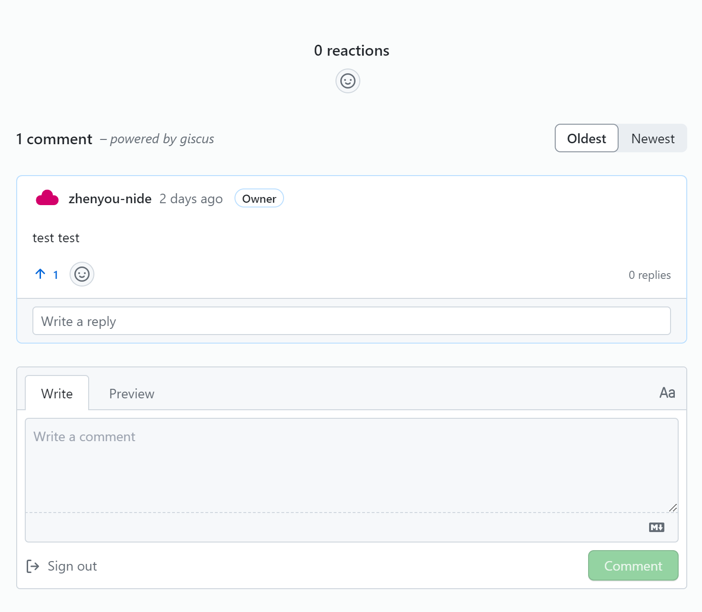
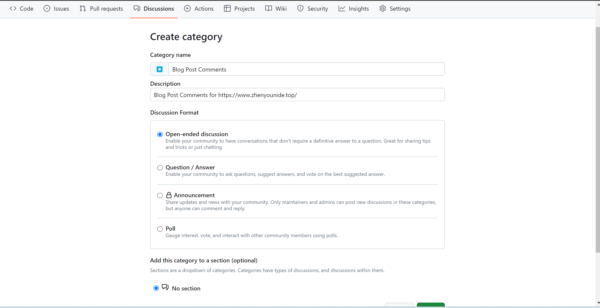
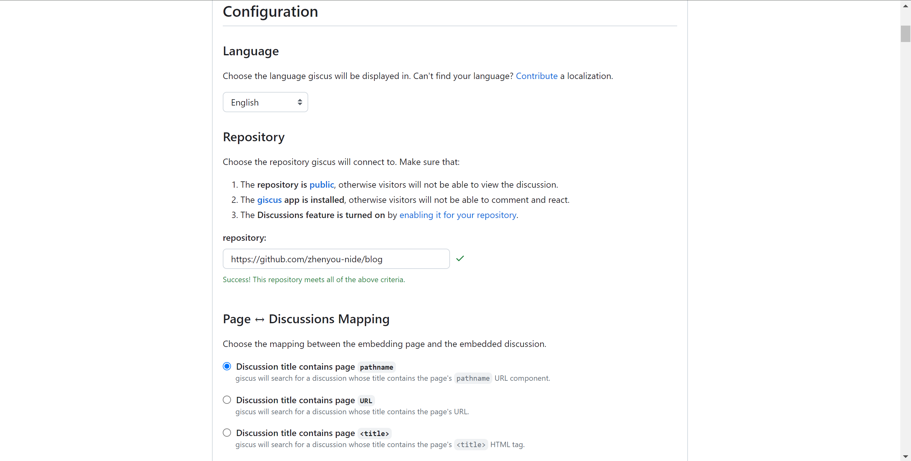
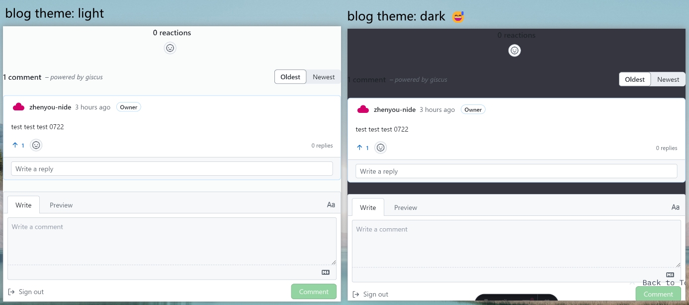

在博客中添加评论功能是接收读者反馈的的一个很好的渠道。

本站是通过 [Astro](https://astro.build/) 构建的，在 Astro 博客中添加评论功能可以通过多种方式实现，常见的方法包括使用第三方评论系统（如 [Disqus](https://disqus.com/)、[Giscus](https://giscus.app)、[Commento](https://commento.io/)）或者自己构建评论功能。

本文将演示如何使用 [Giscus](https://giscus.app) 来添加评论模块，最终效果如下图：


## Table of contents

## 👀 啥是 Giscus

[Giscus](https://giscus.app) 是一个开源的、基于 GitHub Discussions 的免费的评论系统，适用于使用 GitHub 管理评论的用户。无需数据库或者任何的权限系统，所有评论将会被放在 GitHub Discussions 中。

## 🧐如何自定义配置 Giscus

1. 确保 blog repo public.
2. 为 blog repo install Giscus app.
   指路 [Giscus App](https://github.com/apps/giscus)
3. 确保 blog repo 开启了 Discussions 功能
   - enable Discussions: 指路 repo => settings => Features => ✔ Discussions
   - 创建分类：创建一个名为 Blog Post Comment 的分类，设置分类为 Open-ended discussion，指路 https://github.com/username/repo_name/discussions/categories/new
     

严格执行 Giscus config 的上述三点配置后，将 blog repo url 回填入 Giscus App 中，成功的话是这样的：


最后，来简单配置下 Discussions Mapping, Discussion Category，appearance，loading approach

- Discussions Mapping: 强烈建议选择 Discussion title contains page URL 来映射嵌入的页面和嵌入的 discussion.
- category: 选择刚刚创建的 Blog Post Comments.
- appearance: 按需吧，可以多体验下.
- loading approach: 选择 lazy load, 这样只有在用户滚动到 comment 模块才会加载.

至此，我们已完成 Giscus 的配置，在 Enable Giscus 模块下会生成如下一个代码块：

```html
<script
  src="https://giscus.app/client.js"
  data-repo="zhenyou-nide/blog"
  data-repo-id="R_kgDOLsMIjg"
  data-category="Blog Post Comments"
  data-category-id="DIC_kwDOLsMIjs4ChEb_"
  data-mapping="url"
  data-strict="0"
  data-reactions-enabled="1"
  data-emit-metadata="0"
  data-input-position="bottom"
  data-theme="preferred_color_scheme"
  data-lang="en"
  data-loading="lazy"
  crossorigin="anonymous"
  async
></script>
```

## 🛫将 Giscus 添加到博客中

现在，创建一个 `PostComments` 组件，并将上述的代码块添加进来：

例如在 `src/components/PostComments.astro` 中

```astro
<section class="giscus mx-auto mt-10 w-full"></section>

<script
  src="https://giscus.app/client.js"
  data-repo="username/repo"
  data-repo-id="repo-id"
  data-category="Blog Posts Comments"
  data-category-id="DIC_kwDOB3LMn84CaXpn"
  data-mapping="url"
  data-strict="0"
  data-reactions-enabled="1"
  data-emit-metadata="0"
  data-input-position="bottom"
  data-theme="preferred_color_scheme"
  data-lang="en"
  data-loading="lazy"
  crossorigin="anonymous"
  async></script>
```

在 `src/layouts/PostDetails.astro` 中引用该组件：

```astro
---
import Layout from "@layouts/Layout.astro";
import Footer from "@components/Footer.astro";
import PostComments from "@components/PostComments.astro";
---

<Layout>
  <main id="main-content">
    <article id="article" role="article">
      <Content />
    </article>
    <PostComments />
  </main>
  <Footer />
</Layout>
```

完结撒花🎇🎇🎇

等等，还有一个小优化🧐

## ✌一个小优化

本博客站支持切换 dark/light theme，而 `PostComment` 是加载了一个静态 theme（由 script 的 `data-theme` 设置而来

部分 theme.css 使用了 `@media (prefers-color-scheme: dark) { ...dart css}`, 但 Giscus 是一个独立的 iframe，默认无法关联到 blog 的 theme.

当 Giscus 的 `data-theme="preferred_color_scheme"` 时，dark theme 无法被识别到：


😅有一说一还挺报看的...

那么如何在 toggle blog theme 的同时也 toggle Giscus 所在的 iframe 下的 theme 呢？

这里可以通过将一个消息事件从 blog page 发送到 Giscus 来动态更改它！😀

示例如下：

```js
const iframe = document.querySelector("iframe.giscus-frame"); //get the iframe of giscus
if (!iframe) return;
iframe.contentWindow.postMessage(
  { giscus: { setConfig: { theme: localStorage.theme } } },
  "https://giscus.app"
); //send a message with the theme to apply
```

可以把他放在 blog toggle theme 的函数中，这里就不展开了

至此，整个页面就可以丝滑 toggle theme

---

这里也简单介绍下 Disqus 的使用：

Disqus 是一个流行的第三方评论系统，易于集成且功能丰富。

1. 步骤 1：注册 Disqus 并创建站点

   1. 访问 [Disqus](https://disqus.com/) 并注册一个账户。
   2. 创建一个新的站点，获取你的 `shortname`。

2. 步骤 2：在 Astro 中集成 Disqus

在 `src/components/PostComments.astro` 中:

```astro
---
const post = Astro.props;
const siteUrl = Astro.site.origin;
const disqusShortname = "YOUR_DISQUS_SHORTNAME"; // 替换为你的 shortname
const disqusConfig = {
  url: `${siteUrl}/blog/${post.slug}`,
  identifier: post.slug,
  title: post.title,
};
---

<!-- Disqus embed code -->
<div id="disqus_thread"></div>
<script>
  var disqus_config = function () {
    this.page.url = "{disqusConfig.url}";
    this.page.identifier = "{disqusConfig.identifier}";
    this.page.title = "{disqusConfig.title}";
  };
  (function () {
    var d = document,
      s = d.createElement("script");
    s.src = "https://{disqusShortname}.disqus.com/embed.js";
    s.setAttribute("data-timestamp", +new Date());
    (d.head || d.body).appendChild(s);
  })();
</script>
```

同样在 `src/layouts/PostDetails.astro` 中引用该组件：

```astro
---
import Layout from "@layouts/Layout.astro";
import Footer from "@components/Footer.astro";
import PostComments from "@components/PostComments.astro";
---

<Layout>
  <main id="main-content">
    <article id="article" role="article">
      <Content />
    </article>
    <PostComments />
  </main>
  <Footer />
</Layout>
```
