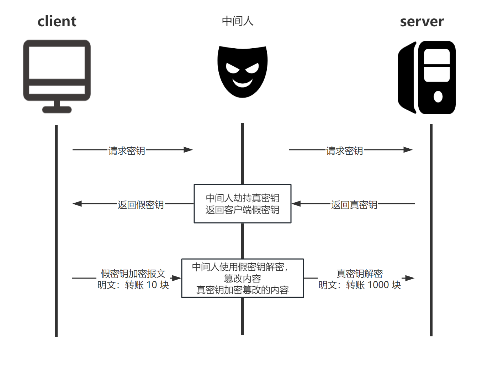
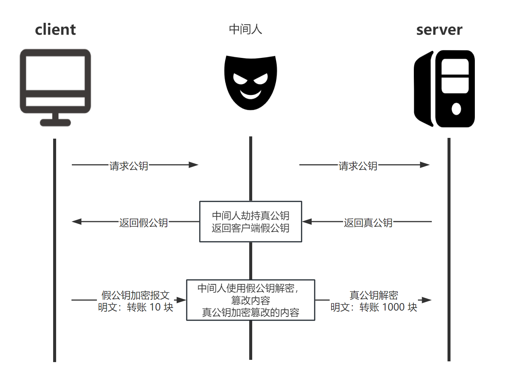
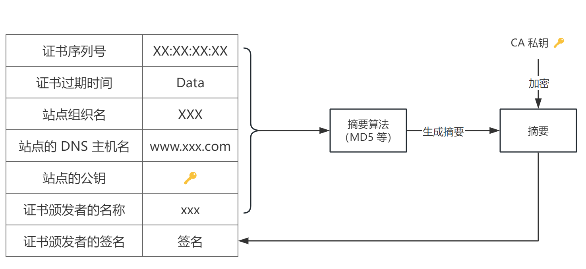

HTTPS 加密过程可以总结为以下步骤：

1. **客户端请求 HTTPS 资源**。
2. **服务器发送 SSL/TLS 证书**。
3. **客户端验证证书**。
4. **客户端和服务器通过 TLS 握手协商加密方式和会话密钥**。
5. **使用对称会话密钥进行加密通信**。

HTTP 为什么不安全呢？

HTTP 由于是明文传输，主要存在三大风险

1. 窃听风险: 中间人可以获取到通信内容

2. 篡改风险: 中间人可以篡改报文内容后再发送给对方

3. 冒充风险: 比如你以为是在和某宝通信，但实际上是在和一个钓鱼网站通信。

HTTPS 显然是为了解决这三大风险而存在的，接下来我们看看 HTTPS 到底解决了什么问题。

### 脑暴过程

1. 既然明文不安全，那协商好密钥，**对称加密**报文如何？

   > **对称加密密钥**是如何协商出来？-> 通过报文的方式直接传输此密钥？-> 之后的通信不还是裸奔 -> ❌

2. 对这个密钥再进行加密呢？
   > 如何解密这个密钥? -> 还是要传输加密密钥, 依然还是会被中间人截获的，不亚于俄罗斯套娃 -> ❌

直接传输密钥无论从哪一端传从上节分析来看是不行了

3. 用 **非对称加密** 来加解密**对称加密密钥**呢？

- server 保管好私钥，传输**公钥**给 client
- client 使用从 server 收到的**公钥**加密**对称加密密钥**后传给 server
- server 使用私钥解密后即可拿到**对称加密密钥**，这样回答了 1 中的 **对称加密**密钥是如何协商出来 这一问题
- 接下来就可以用对称加密密钥，进行后续的通信

> server 怎么把公钥**安全地**传输给 client 呢? -> 直接传公钥? -> 也会存在被中间人调包的风险 -> ❌

现在只需要解决如何安全的将**公钥**传输给 client 即可；client 有了安全且可信任的公钥后，用此公钥加密**对称加密密钥**后发给 server，server 用私钥解密，得到**对称加密密钥**，后续的通信用此**对称加密密钥**来对报文进行对称加密。

4. 数字证书来解决公钥传输的安全问题

   - server 向 CA 申请证书，证书内容包括

     - 证书明文
     - 证书签名：由 CA 的私钥去加密证书摘要（md5(证书明文)）得来

     

   - server 传输证书给 client
   - client 收到来自 server 的证书

     - 摘要 A = md5(证书明文)
     - 使用 CA 公钥（在 Root CA 证书（是被操作系统信任的，内置在操作系统上的证书，无需传输）中获得）获得摘要 B
     - 对比 摘要 A === 摘要 B

     

发散想想，HTTPS 既然是加密的， charles 为啥能抓到明文的包呢，其实就是用了证书调包这一手法，我们在用 charles 抓 HTTPS 的包之前我们先要安装 charles 的证书；这个证书里有 charles 的公钥，这样的话 charles 就可以将 server 传给 client 的证书调包成自己的证书，client 拿到后就可以用你安装的 charles 证书来验签等，验证通过之后就会用 charles 证书中的公钥来加密对称密钥了
