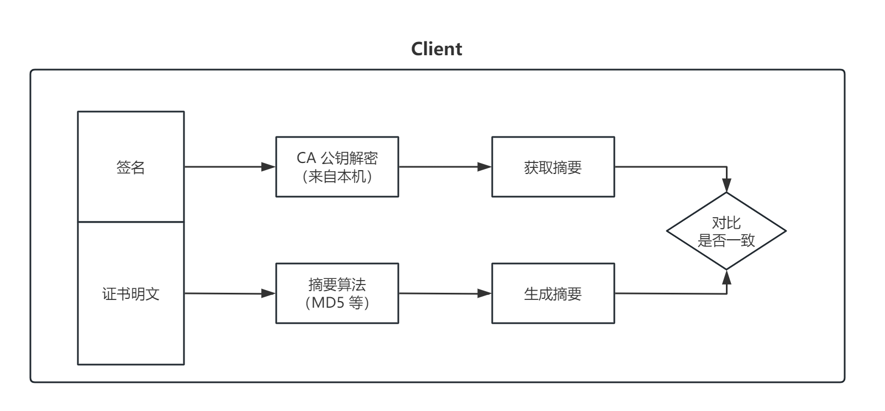

HTTP（HyperText Transfer Protocol）被认为不安全，主要原因是它缺乏数据加密和身份验证机制。以下是 HTTP 不安全的具体原因：

1. 数据明文传输

   **无加密**：HTTP 传输的数据是明文的，任何人都可以在数据传输过程中拦截并读取这些数据。这意味着包括用户名、密码、信用卡信息等敏感数据在内的所有信息都可以被第三方截获。

2. 无身份验证

   **无法验证服务器身份**：HTTP 协议没有内置的机制来验证客户端与服务器之间的连接是合法的。这使得中间人攻击（Man-in-the-Middle Attack）变得可能，即攻击者可以假装成目标服务器与客户端通信，窃取或篡改数据。

3. 数据完整性无法保证

   **易受篡改**：由于 HTTP 数据在传输过程中没有加密，也没有任何校验机制，数据容易被中途篡改。攻击者可以在数据传输过程中修改数据，而客户端和服务器无法检测到这种篡改。

4. 易受各种攻击

   **中间人攻击**：攻击者可以拦截并修改客户端和服务器之间的通信内容。
   **监听攻击**：攻击者可以监听 HTTP 流量，获取敏感信息。
   **会话劫持**：攻击者可以通过拦截会话令牌，冒充用户进行操作。

5. 无法提供隐私保护

   **用户隐私暴露**：由于数据以明文形式传输，用户的浏览习惯、个人信息和其他敏感数据都可能被第三方截获和分析。

HTTPS（HyperText Transfer Protocol Secure）通过在 HTTP 之上添加 SSL/TLS 层来解决这些问题。以下是 HTTPS 的优势：

1. **数据加密**：通过加密传输的数据，防止被第三方截获。
2. **身份验证**：通过 SSL/TLS 证书验证服务器身份，防止中间人攻击。
3. **数据完整性**：通过加密和校验机制，防止数据被篡改。
4. **隐私保护**：通过加密传输数据，保护用户隐私和敏感信息。

HTTPS 加密过程可以总结为以下步骤：

1. **客户端请求 HTTPS 资源**。
2. **服务器发送 SSL/TLS 证书**。
3. **客户端验证证书**。
4. **客户端和服务器通过 TLS 握手协商加密方式和会话密钥**。
5. **使用对称会话密钥进行加密通信**。

### 脑暴过程

1. 既然明文不安全，那协商好密钥，**对称加密**报文如何？

   > **对称加密密钥**是如何协商出来？-> 通过报文的方式直接传输此密钥？-> 之后的通信不还是裸奔 -> ❌

2. 对这个密钥再进行加密呢？
   > 如何解密这个密钥? -> 还是要传输加密密钥, 依然还是会被中间人截获的，不亚于俄罗斯套娃 -> ❌

直接传输密钥无论从哪一端传，从上节分析来看是不行了

对称加密有着加解密速度快，性能高的特点，其实它也是 HTTPS 最终采用的加密形式，所以我们现在要解决的问题还是，如何协商出同一把密钥，用于后续对称加密报文传输呢

3. 用**非对称加密**来加解密**对称加密密钥**呢？

   - server 保管好私钥，传输**公钥**给 client
   - client 使用从 server 收到的**公钥**加密**对称加密密钥**后传给 server
   - server 使用私钥解密后即可拿到**对称加密密钥**，这样回答了 1 中的 **对称加密**密钥是如何协商出来 这一问题
   - 接下来就可以用对称加密密钥，进行后续的通信

   > server 怎么把公钥**安全地**传输给 client 呢? -> 直接传公钥? -> 也会存在被中间人调包的风险 -> ❌

   

好了，现在只需要解决如何安全的将**公钥**传输给 client 即可；client 有了安全且可信任的公钥后，用此公钥加密**对称加密密钥**后发给 server，server 用私钥解密，得到**对称加密密钥**，后续的通信用此**对称加密密钥**来对报文进行对称加密

4. 数字证书来解决公钥传输的安全问题

   - server 向 CA 申请证书，证书内容包括

     - 证书明文
     - 证书签名：由 CA 的私钥去加密证书摘要（md5(证书明文)）得来

     

   - server 传输证书给 client
   - client 收到来自 server 的证书

     - 摘要 A = md5(证书明文)
     - 使用 CA 公钥（在 Root CA 证书（是被操作系统信任的，内置在操作系统上的证书，无需传输）中获得）获得摘要 B
     - 对比 摘要 A === 摘要 B

     

发散想想，HTTPS 既然是加密的， charles 为啥能抓到明文的包呢，其实就是用了证书调包这一手法，我们在用 charles 抓 HTTPS 的包之前我们先要安装 charles 的证书；这个证书里有 charles 的公钥，这样的话 charles 就可以将 server 传给 client 的证书调包成自己的证书，client 拿到后就可以用你安装的 charles 证书来验签等，验证通过之后就会用 charles 证书中的公钥来加密对称密钥了
