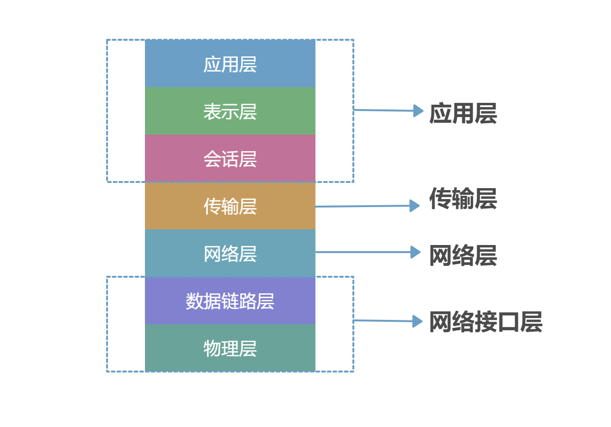
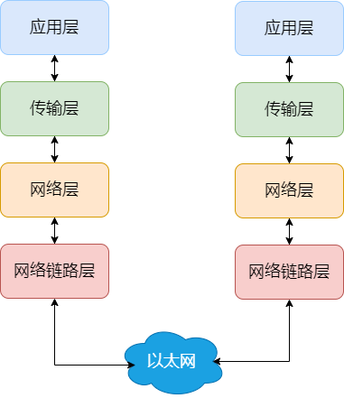
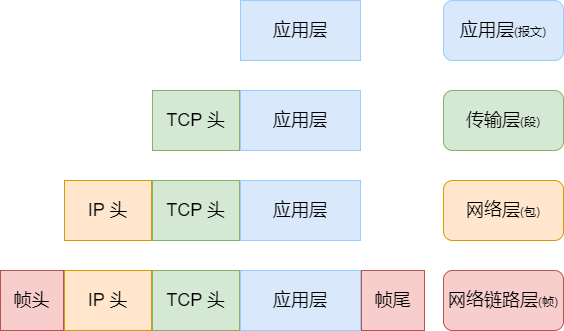
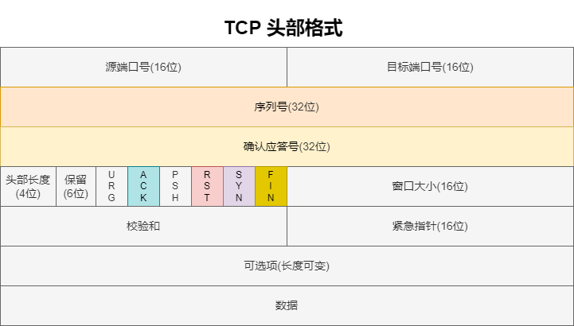
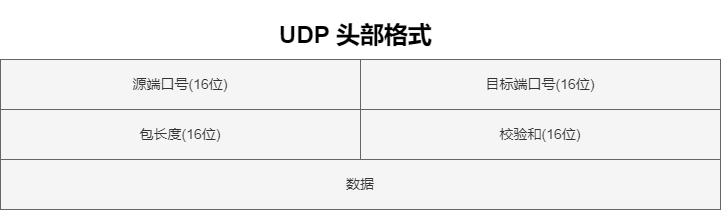

## Table of contents

## OSI 和 TCP/IP 网络模型

OSI 的七层体系结构概念清楚，理论也很完整，但是它比较复杂而且不实用，而且有些功能在多个层中重复出现。

TCP/IP 四层模型是目前被广泛采用的一种模型，我们可以将 TCP/IP 模型看作是 OSI 七层模型的精简版本（并不能完全精准匹配），由以下 4 层组成：

### 应用层

**两个终端设备上的应用程序**之间的信息交换，定义了信息交换的格式，消息交给下一层**传输层**

常见的应用层协议有：

- HTTP 主要是为 Web 浏览器与 Web 服务器之间的通信而设计的
- WebSocket 基于 TCP 的全双工通信协议（仅需一次握手），客户端和服务端直接可同时接发
- SMTP/POP3 邮件发送/接收协议
- FTP 基于 TCP 协议，是一种用于在计算机之间传输文件的协议
- RTP 通常基于 UDP 协议，但也支持 TCP 协议。它提供了端到端的实时传输数据的功能
- DNS 基于 UDP 协议，用于解决域名和 IP 地址的映射问题

### 传输层

负责向两台终端设备进程之间的通信提供通用的数据传输服务。是为应用层提供网络支持的。

- TCP（Transmission Control Protocol，传输控制协议）：提供 **面向连接** 的，**可靠** 的数据传输服务。
- UDP（User Datagram Protocol，用户数据协议）：提供 **无连接** 的，**尽最大努力** 的数据传输服务（不保证数据传输的可靠性），简单高效。

### 网络层

应用层和传输层都是端到端的协议，而网络层及以下都是中间件的协议了

主要协议包括：

- IP（Internet Protocol，网际协议），
- ARP（Address Resolution Protocol，地址解析协议），
- ICMP 协议（控制报文协议，用于发送控制消息），
- NAT（Network Address Translation，网络地址转换协议），
- OSPF（Open Shortest Path First，开放式最短路径优先），
- RIP（Routing Information Protocol，路由信息协议，
- BGP（Border Gateway Protocol，边界网关协议）

网络层最常使用的是 IP 协议 (Internet Protocol)，IP 协议会将传输层的报文作为数据部分，再加上 IP 头组装成 IP 报文，如果 IP 报文大小超过 MTU （以太网中一般为 1500 字节）就会再次进行分片，得到个即将发送到网络的 IP 报文。

网络层最重要的五个字：**转发与路由**。

- 转发：将分组从路由器的输入端口转移到合适的输出端口。
- 路由：确定分组从源到目的经过的路径。

### 网络链路层

生成了 IP 头部之后，接下来要交给网络链路层 (Link Layer)，在 IP 头部的前面加上 MAC 头部，并封装成数据帧 (Data frame) 发送到网络上。

以太网就是一种在**局域网**把附近的设备连接起来，使它们之间可以进行通讯的技术。电脑上的以太网接口，Wi-Fi 接口，以太网交换机、路由器上的干兆，万兆以太网口还有网线，它们都是以太网的组成部分

MAC 头部是以太网使用的头部，它包含了接收方和发送方的 MAC 地址等信息，我们可以通过 ARP 协议获取对方的 MAC 地址。

所以说，网络链路层主要为网络层提供**链路级别**传输的服务，负责在以太网、WiFi 这样的底层网络上发送原始数据包，工作在网卡这个层次，使用 MAC 地址来标识网络上的设备。

### 总结

**为啥要分层？**

> 计算机科学领域的任何问题都可以通过增加一个间接的中间层来解决，计算机整个体系从上到下都是按照严格的层次结构设计的

## TCP

### 基本

#### TCP 是什么

TCP 是面向连接的（一定是**一对一**才能连接）、可靠的、基于字节流的传输层通信协议。

#### TCP 连接是什么

客户端与服务端达成以下三个信息的共识后建立一个 TCP 连接

1. Socket: 由 IP 地址和端口号组成
2. 序列号：用来解决乱序问题
3. 窗口大小：流量控制

#### 为什么需要 TCP 协议

IP 层是**不可靠**的，它不保证网络包的交付、不保证网络包的按序交付、也不保证网络包中的数据的完整性。

TCP 是一个工作在<strong>传输层</strong>的<strong>可靠</strong>数据传输的服务，它能确保接收端接收的网络包是<strong>无损坏、无间隔、非冗余和按序的。</strong>

#### 如何唯一确定一个 TCP 连接

TCP 四元组可以唯一的确定一个连接，四元组包括：

- 源地址
- 目的地址
- 源端口号
- 目的端口号

源地址和目的地址的字段（32 位）是在 IP 头部中，作用是通过 IP 协议发送报文给对方主机。

源端口和目的端口的字段（16 位）是在 TCP 头部中，作用是告诉 TCP 协议应该把报文发给哪个进程。

#### TCP header

1. 序列号：建立连接时由计算机随机生成，通过 SYN 包传给接收端，每发送一次数据就累加一次该值。**用来解决网络包乱序的问题**
2. 确认应答号：指下一次期望收到的数据的序列号。**用来解决丢包的问题**
3. 控制位：
   - ACK: 该位为 1 时，确认应答号为有效。TCP 规定除了建立连接时 SYN 包之外，该位必须设置为 1
   - RST: 该位为 1 时，表示 TCP 连接出现异常，必须强制中断连接
   - SYN: 该位为 1 时，表示希望建立连接，并在其序列号的字段进行序列号的初始值设定
   - FIN: 该位为 1 时，表示今后不再有数据发送，希望断开连接。当通信结束希望断开连接时，通信双方的主机之间相互交换 FIN 为 1 的 TCP 段

#### UDP vs TCP

UDP 不提供复杂的控制机制，利用 IP 提供面向**无连接**的通信服务。

UDP 协议真的非常简，头部只有 8 个字节（64 位）

- 目标和源端口：主要是告诉 UDP 协议应该把报文发给哪个进程。
- 包长度：该字段保存了 UDP 首部的长度跟数据的长度之和。
- 校验和：校验和是为了提供可靠的 UDP 首部和数据而设计，防止收到在网络传输中受损的 UDP 包。

**区别如下：**

1. 连接
   - TCP 是面向连接的传输层协议，传输数据前先要建立连接。
   - UDP 是不需要连接，即刻传输数据。
2. 服务对象
   - TCP 是一对一的两点服务，即一条连接只有两个端点。
   - UDP 支持一对一、一对多、多对多的交互通信
3. 可靠性数据
   - TCP 是可靠交付数据的，可以无差错、不丢失、不重复、按序到达，
   - UDP 是尽最大努力交付，不保证可靠交付数据。但是我们可以基于 UDP 传输协议实现一个可靠的传输协议，比如 QUIC 协议
4. 拥塞控制、流量控制

   - TCP 有拥塞控制和流量控制机制，保证数据传输的安全性：
   - UDP 则没有，即使网络非常拥堵了，也不会影响 UDP 的发送速率

5. 首部开销
   - TCP 首部长度较长，会有一定的开销，首部在没有使用**选项**字段时是 20 字节，如果使用了**选项**字段则会变长的。
   - UDP 首部只有 8 个字节，并且是固定不变的，开销较小。
6. 传输方式
   - TCP 是流式传输，没有边界，但保证顺序和可靠。
   - UDP 是一个包一个包的发送，是有边界的，但可能会丢包和乱序。
7. 分片不同

   - TCP 的数据大小如果大于 MSS 大小，则会在传输层进行分片，目标主机收到后也同样在传输层组装 TCP 数据包，如果中途丢失了一个分片，只需要传输丢失的这个分片。
   - UDP 的数据大小如果大于 MTU 大小，则会在 IP 层进行分片，目标主机收到后在 IP 层组装完数据，接着再传给传输层。

8. 使用场景
   - TCP: https/http/ftp 文件传输
   - UDP: 包总量较少的通信：DNS，视频/音频等多媒体通信

为什么 UDP 头部没有<strong>首部长度</strong>字段，而 TCP 头部有<strong>首部长度</strong>字段呢？

原因是 TCP 有<strong>可变长</strong>的<strong>选项</strong>字段，而 UDP 头部长度则是<strong>不会变化</strong>的，无需多一个字段去记录 UDP 的首部长度。

为什么 UDP 头部有<strong>包长度</strong>字段，而 TCP 头部则没有<strong>包长度</strong>字段呢？

<code>TCP 数据长度 = IP 总长度 - IP 首部长度 - TCP 首部长度</code>; 其中 IP 总长度 和 IP 首部长度，在 IP 首部格式是已知的。TCP 首部长度，则是在 TCP 首部格式已知的，所以就可以求得 TCP 数据的长度。

UDP 也是基于 IP 层的呀，那 UDP 的数据长度也可以通过这个公式计算呀？ 为何还要有<strong>包长度</strong>呢？

我也不知道

#### TCP 和 UDP 可以使用一个端口吗

**可以的**

在数据链路层中，通过 MAC 地址来寻找局域网中的主机。

在网际层中，通过 IP 地址来寻找网络中互连的主机或路由器。

在传输层中，需要通过端口进行寻址，来识别同一计算机中同时通信的不同应用程序。

所以，传输层的**端口号**的作用，是为了区分同一个主机上不同应用程序的数据包。

传输层有两个传输协议分别是 TCP 和 UDP，在内核中是两个完全独立的软件模块。

当主机收到数据包后，可以在 IP 包头**协议号**字段知道该数据包是 TCP/UDP，所以可以根据这个信息确定送给哪个模块（TCP/UDP）处理，送给 TCP/UDP 模块的报文根据**端口号**确定送给哪个应用程序处理。

### 连接建立

#### TCP 三次握手过程

#### 为什么是三次

#### 第 2 次握手传回了 ACK，为什么还要传回 SYN？

#### 初始序列号 ISN

##### 为什么要求要不一样？

##### 如何产生的

#### 既然 IP 会分片，为什么 TCP 还要控制 MSS 呢

#### 握手失败了会发生什么

##### 第一次丢失

##### 第二次丢失

##### 第三次丢失

#### SYN 攻击

### 连接断开

#### TCP 四次挥手过程是怎样的？

#### 为什么挥手需要四次？<

#### 挥手丢失了，会发生什么？

##### 第一次丢失

##### 第二次丢失

##### 第三次丢失

##### 第四次丢失

#### 为什么 TIME_WAIT 等待的时间是 2MSL？

#### 为什么需要 TIME_WAIT 状态？

#### TIME_WAIT 过多有什么危害？

#### 如何优化 TIME_WAIT？

#### 服务器出现大量 TIME_WAIT 状态的原因有哪些？

#### 服务器出现大量 CLOSE_WAIT 状态的原因有哪些？

#### 如果已经建立了连接，但是客户端突然出现故障了怎么办？

#### 如果已经建立了连接，但是服务端的进程崩溃会发生什么？

## IP
