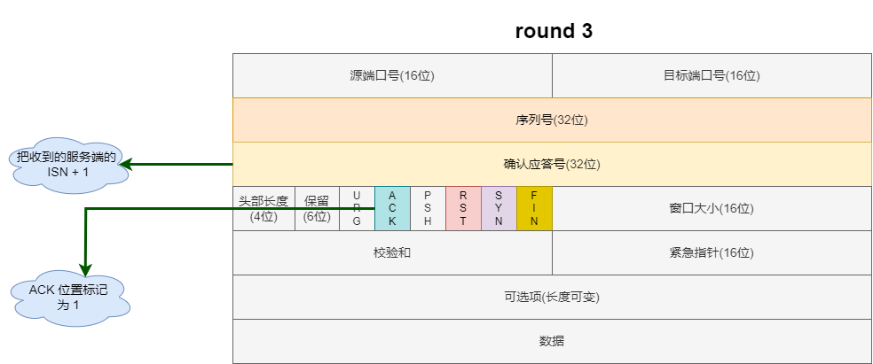
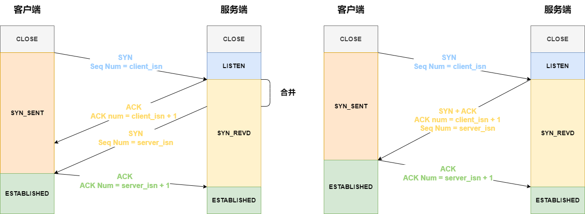

## Table of contents

[link](https://javaguide.cn/cs-basics/network/osi-and-tcp-ip-model.html#osi-%E4%B8%83%E5%B1%82%E6%A8%A1%E5%9E%8B)

[tcp](https://xiaolincoding.com/network/3_tcp/tcp_interview.html)

## OSI 和 TCP/IP 网络模型

OSI 的七层体系结构概念清楚，理论也很完整，但是它比较复杂而且不实用，而且有些功能在多个层中重复出现。

TCP/IP 四层模型是目前被广泛采用的一种模型，我们可以将 TCP/IP 模型看作是 OSI 七层模型的精简版本（并不能完全精准匹配），由以下 4 层组成：

### 应用层

**两个终端设备上的应用程序**之间的信息交换，定义了信息交换的格式，消息交给下一层**传输层**

常见的应用层协议有：

- HTTP 主要是为 Web 浏览器与 Web 服务器之间的通信而设计的
- WebSocket 基于 TCP 的全双工通信协议（仅需一次握手），客户端和服务端直接可同时接发
- SMTP/POP3 邮件发送/接收协议
- FTP 基于 TCP 协议，是一种用于在计算机之间传输文件的协议
- RTP 通常基于 UDP 协议，但也支持 TCP 协议。它提供了端到端的实时传输数据的功能
- DNS 基于 UDP 协议，用于解决域名和 IP 地址的映射问题

### 传输层

负责向两台终端设备进程之间的通信提供通用的数据传输服务。是为应用层提供网络支持的。

- TCP（Transmission Control Protocol，传输控制协议）：提供 **面向连接** 的，**可靠** 的数据传输服务。
- UDP（User Datagram Protocol，用户数据协议）：提供 **无连接** 的，**尽最大努力** 的数据传输服务（不保证数据传输的可靠性），简单高效。

### 网络层

应用层和传输层都是端到端的协议，而网络层及以下都是中间件的协议了

主要协议包括：

- IP（Internet Protocol，网际协议），
- ARP（Address Resolution Protocol，地址解析协议），
- ICMP 协议（控制报文协议，用于发送控制消息），
- NAT（Network Address Translation，网络地址转换协议），
- OSPF（Open Shortest Path First，开放式最短路径优先），
- RIP（Routing Information Protocol，路由信息协议，
- BGP（Border Gateway Protocol，边界网关协议）

网络层最常使用的是 IP 协议 (Internet Protocol)，IP 协议会将传输层的报文作为数据部分，再加上 IP 头组装成 IP 报文，如果 IP 报文大小超过 MTU （以太网中一般为 1500 字节）就会再次进行分片，得到个即将发送到网络的 IP 报文。

网络层最重要的五个字：**转发与路由**。

- 转发：将分组从路由器的输入端口转移到合适的输出端口。
- 路由：确定分组从源到目的经过的路径。

### 网络链路层

生成了 IP 头部之后，接下来要交给网络链路层 (Link Layer)，在 IP 头部的前面加上 MAC 头部，并封装成数据帧 (Data frame) 发送到网络上。

以太网就是一种在**局域网**把附近的设备连接起来，使它们之间可以进行通讯的技术。电脑上的以太网接口，Wi-Fi 接口，以太网交换机、路由器上的干兆，万兆以太网口还有网线，它们都是以太网的组成部分

MAC 头部是以太网使用的头部，它包含了接收方和发送方的 MAC 地址等信息，我们可以通过 ARP 协议获取对方的 MAC 地址。

所以说，网络链路层主要为网络层提供**链路级别**传输的服务，负责在以太网、WiFi 这样的底层网络上发送原始数据包，工作在网卡这个层次，使用 MAC 地址来标识网络上的设备。

### 总结

**为啥要分层？**

> 计算机科学领域的任何问题都可以通过增加一个间接的中间层来解决，计算机整个体系从上到下都是按照严格的层次结构设计的

## HTTP

## TCP

### 基本

#### TCP 是什么

TCP 是面向连接的（一定是**一对一**才能连接）、可靠的、基于字节流的传输层通信协议。

#### TCP 连接是什么

客户端与服务端达成以下三个信息的共识后建立一个 TCP 连接

1. Socket: 由 IP 地址和端口号组成
2. 序列号：用来解决乱序问题
3. 窗口大小：流量控制

#### 为什么需要 TCP 协议

IP 层是**不可靠**的，它不保证网络包的交付、不保证网络包的按序交付、也不保证网络包中的数据的完整性。

TCP 是一个工作在<strong>传输层</strong>的<strong>可靠</strong>数据传输的服务，它能确保接收端接收的网络包是<strong>无损坏、无间隔、非冗余和按序的。</strong>

#### 如何唯一确定一个 TCP 连接

TCP 四元组可以唯一的确定一个连接，四元组包括：

- 源地址
- 目的地址
- 源端口号
- 目的端口号

源地址和目的地址的字段（32 位）是在 IP 头部中，作用是通过 IP 协议发送报文给对方主机。

源端口和目的端口的字段（16 位）是在 TCP 头部中，作用是告诉 TCP 协议应该把报文发给哪个进程。

#### TCP header

1. 序列号：建立连接时由计算机随机生成，通过 SYN 包传给接收端，每发送一次数据就累加一次该值。**用来解决网络包乱序的问题**
2. 确认应答号：指下一次期望收到的数据的序列号。**用来解决丢包的问题**
3. 控制位：
   - ACK: 该位为 1 时，确认应答号为有效。TCP 规定除了建立连接时 SYN 包之外，该位必须设置为 1
   - RST: 该位为 1 时，表示 TCP 连接出现异常，必须强制中断连接
   - SYN: 该位为 1 时，表示希望建立连接，并在其序列号的字段进行序列号的初始值设定
   - FIN: 该位为 1 时，表示今后不再有数据发送，希望断开连接。当通信结束希望断开连接时，通信双方的主机之间相互交换 FIN 为 1 的 TCP 段

#### UDP vs TCP

UDP 不提供复杂的控制机制，利用 IP 提供面向**无连接**的通信服务。

UDP 协议真的非常简，头部只有 8 个字节（64 位）

- 目标和源端口：主要是告诉 UDP 协议应该把报文发给哪个进程。
- 包长度：该字段保存了 UDP 首部的长度跟数据的长度之和。
- 校验和：校验和是为了提供可靠的 UDP 首部和数据而设计，防止收到在网络传输中受损的 UDP 包。

**区别如下：**

1. 连接
   - TCP 是面向连接的传输层协议，传输数据前先要建立连接。
   - UDP 是不需要连接，即刻传输数据。
2. 服务对象
   - TCP 是一对一的两点服务，即一条连接只有两个端点。
   - UDP 支持一对一、一对多、多对多的交互通信
3. 可靠性数据
   - TCP 是可靠交付数据的，可以无差错、不丢失、不重复、按序到达，
   - UDP 是尽最大努力交付，不保证可靠交付数据。但是我们可以基于 UDP 传输协议实现一个可靠的传输协议，比如 QUIC 协议
4. 拥塞控制、流量控制

   - TCP 有拥塞控制和流量控制机制，保证数据传输的安全性：
   - UDP 则没有，即使网络非常拥堵了，也不会影响 UDP 的发送速率

5. 首部开销
   - TCP 首部长度较长，会有一定的开销，首部在没有使用**选项**字段时是 20 字节，如果使用了**选项**字段则会变长的。
   - UDP 首部只有 8 个字节，并且是固定不变的，开销较小。
6. 传输方式
   - TCP 是流式传输，没有边界，但保证顺序和可靠。
   - UDP 是一个包一个包的发送，是有边界的，但可能会丢包和乱序。
7. 分片不同

   - TCP 的数据大小如果大于 MSS 大小，则会在传输层进行分片，目标主机收到后也同样在传输层组装 TCP 数据包，如果中途丢失了一个分片，只需要传输丢失的这个分片。
   - UDP 的数据大小如果大于 MTU 大小，则会在 IP 层进行分片，目标主机收到后在 IP 层组装完数据，接着再传给传输层。

8. 使用场景
   - TCP: https/http/ftp 文件传输
   - UDP: 包总量较少的通信：DNS，视频/音频等多媒体通信

为什么 UDP 头部没有<strong>首部长度</strong>字段，而 TCP 头部有<strong>首部长度</strong>字段呢？

原因是 TCP 有<strong>可变长</strong>的<strong>选项</strong>字段，而 UDP 头部长度则是<strong>不会变化</strong>的，无需多一个字段去记录 UDP 的首部长度。

为什么 UDP 头部有<strong>包长度</strong>字段，而 TCP 头部则没有<strong>包长度</strong>字段呢？

<code>TCP 数据长度 = IP 总长度 - IP 首部长度 - TCP 首部长度</code>; 其中 IP 总长度 和 IP 首部长度，在 IP 首部格式是已知的。TCP 首部长度，则是在 TCP 首部格式已知的，所以就可以求得 TCP 数据的长度。

UDP 也是基于 IP 层的呀，那 UDP 的数据长度也可以通过这个公式计算呀？ 为何还要有<strong>包长度</strong>呢？

我也不知道

#### TCP 和 UDP 可以使用一个端口吗

**可以的**

在数据链路层中，通过 MAC 地址来寻找局域网中的主机。

在网际层中，通过 IP 地址来寻找网络中互连的主机或路由器。

在传输层中，需要通过端口进行寻址，来识别同一计算机中同时通信的不同应用程序。

所以，传输层的**端口号**的作用，是为了区分同一个主机上不同应用程序的数据包。

传输层有两个传输协议分别是 TCP 和 UDP，在内核中是两个完全独立的软件模块。

当主机收到数据包后，可以在 IP 包头**协议号**字段知道该数据包是 TCP/UDP，所以可以根据这个信息确定送给哪个模块（TCP/UDP）处理，送给 TCP/UDP 模块的报文根据**端口号**确定送给哪个应用程序处理。

### 连接建立

#### TCP 三次握手过程

- 一开始，客户端和服务端都处于 CLOSE 状态。
- 服务端主动监听某个端口，处于 LISTEN 状态。

- 客户端随机一个初始化序号（client_isn）,置于 TCP 头部的**序列号**字段中
  - 同时，将 SYN 位置标记为 1
  - 将此报文发送给服务端，表示想建立连接
  - 该报文不包含应用层数据，此后客户端处于 SYN_SENT 状态

- 服务端收到客户端的 SYN 报文后
  - 首先，服务端也随机一个初始化序列号（server_isn）,置于 TCP 头部的**序列号**字段中
  - 同时，将 TCP 头部的**确认应答号**字段填入 client_isn + 1
  - 接着将 SYN 位置和 ACK 位置都标记为 1
  - 将此报文发送给客户端，表示接受连接
  - 该报文不包含应用层数据，此后服务端处于 SYN_RCVD 状态

- 客户端收到服务端的报文后，还要向服务端回应一个应答报文

  - 首先，该报文 TCP 头部的**确认应答号**字段填入 server_isn + 1
  - 同时，将 ACK 位置标记为 1
  - 将此报文发送给服务端
  - 该报文**可以包含**应用层数据，此后客户端处于 ESTABLISHED 状态

- 服务端收到客户端的应答报文后，服务端处于 ESTABLISHED 状态

#### 为什么是三次

白话版：**保证双方都具有接收和发送的能力**

终极版：

TCP 连接主要是保证 Socked，序列号，窗口大小等信息的组合的可靠性和稳定性的传输。

那么**三次握手**是怎么初始化 Socked，序列号，窗口大小并建立连接呢？主要是如下三个原因：

- 三次握手可以阻止重复历史连接的初始化
- 三次握手可以同步双方初始序列号
- 三次握手可以避免资源浪费

##### 原因一：避免历史连接（main）

试想一个场景：

客户端先发送了 SYN（seq = 90）报文，然后客户端宕机了且网络堵塞了，服务端还没有收到。

客户端重启后，重新向服务端发起连接，发送 SYN（seq = 100）报文（注意这里不是重传，重传的 Seq 是一样的）

SYN（seq = 90）报文较早到达服务端，服务端会返回一个 SYN + ACK 的报文给客户端，此报文中确认应答号为 91(90+1)

客户端收到后，发现与自己期望的 101(100+1) 不符，于是就会回 RST 报文

服务端收到 RST 报文后，就会释放连接

后续 SYN（seq = 100）到达服务端后，客户端与服务端即可进行正常的三次握手了

**那么为什么两次握手做不到避免历史连接呢**

主要是因为在两次握手的情况下，服务端没有中间状态给客户端来阳止历史连接，导致服务端可能建立一个历史连接，造成资源浪费。

在两次握手的情况下，服务端在收到 SYN 报文后，就进入 ESTABLISHED 状态，意味着这时可以给对方发送数据

但是客户端此时还没有进入 ESTABLISHED 状态

假设这次是历史连接，客户端判断到此次连接为历史连接，那么就会回 RST 报文来断开连接，而服务端在第一次握手的时候就进入 ESTABLISHED 状态

所以它可以发送数据的，但是它并不知道这个是历史连接，它只有在收到 RST 报文后，才会断开连接。

##### 原因二：同步双方初始序列号

TCP 协议的通信双方，都必须维护一个**序列号**，序列号是可靠传输的一个关键因素，它的作用:

- 接收方可以去除重复的数据;
- 接收方可以根据数据包的序列号按序接收;
- 可以标识发送出去的数据包中， 哪些是已经被对方收到的(通过 ACK 报文中的序列号知道)

当客户端发送携带**初始序列号**的 SYN 报文的时候，需要服务端回一个 ACK 应答报文，表示客户端的 SYN 报文已被服务端成功接收，那当服务端发送**初始序列**给客户端的时候，依然也要得到客户端的应答回应，这样一来一回，才能确保双方的初始序列号能被可靠的同步。

四次握手其实也能够可靠的同步双方的初始化序号，但由于第二步和第三步可以优化成一步，所以就成了三次握手。

而两次握手只保证了一方的初始序列号能被对方成功接收，没办法保证双方的初始序列号都能被确认接收。

##### 原因三：避免资源浪费

如果只有两次握手，当客户端发生的 SYN 报文在网络中阻塞，客户端没有接收到 ACK 报文，就会重新发送 SYN，由于没有第三次握手，服务端不清楚客户端是否收到了自己回复的 ACK 报文，所以服务端每收到一个 SYN 就只能先主动建立一个连接，这会造成什么情况呢?
如果客户端发送的 SYN 报文在网络中阻塞了，重复发送多次 SYN 报文，那么服务端在收到请求后就会建立多个兄余的无效链接，造成不必要的资源浪费。

##### 总结

两次握手: 无法防止历史连接的建立，会造成双方资源的浪费，也无法可靠的同步双方序列号
四次握手: 三次握手就已经理论上最少可靠连接建立，所以不需要使用更多的通信次数。

#### 第 2 次握手传回了 ACK，为什么还要传回 SYN？

- 传 ACK 是为了告诉客户端：我接收到的信息确实就是你所发送的信号了，这表明从客户端到服务端的通信是正常的。
- 传 SYN 则是为了建立并确认从服务端到客户端的通信。

#### 初始序列号 ISN

##### 为什么要求要不一样？

主要原因有两个方面

- 为了防止历史报文被下一个相同四元组的连接接收(main)
- 为了安全性，防止黑客伪造的相同序列号的 TCP 报文被对方接收

##### 如何产生的

起始 ISN 是基于时钟的，每 4 微秒 +1，转一圈要 4.55 个小时。

RFC793 提到初始化序列号 ISN 随机生成算法: ISN=M+F(localhost, localport, remotehost, remoteport)

M 是一个计时器，这个计时器每隔 4 微秒加 1.

F 是一个 Hash 算法，根据源 IP、目的 IP、源端口、目的端口生成一个随机数值。

随机数是会基于时钟计时器递增的，基本不可能会随机成一样的初始化序列号。

#### 既然 IP 会分片，为什么 TCP 还要控制 MSS 呢

- MTU: 一个网络包的最大长度，以太网中一般为 1500 字节
- MSS: 除去 IP 和 TCP 头部之后，一个网络包所能容纳的 TCP 数据的最大长度;

IP 层本身没有超时重传机制，它由传输层的 TCP 来负责超时和重传。

如果在 TCP 的整个报文(头部 + 数据)交给 IP 层进行分片，当 IP 层有一个超过 MTU 大小的数据(TCP 头部 + TCP 数据)要发送，那么 IP 层就要进行分片，把数据分片成若干片，保证每一个分片都小于 MTU。把一份 IP 数据报进行分片以后，由目标主机的 IP 层来进行重新组装后，再交给上一层 TCP 传输层。

如果一个 IP 分片丢失，接收方的 IP 层就无法组装成一个完整的 TCP 报文(头部+数据)，也就无法将数据报文送到 TCP 层，所以接收方不会响应 ACK 给发送方，因为发送方迟迟收不到 ACK 确认报文，所以会触发超时重传，就会重发**整个 TCP 报文(头部+数据)**

因此，可以得知由 IP 层进行分片传输，是非常没有效率的。
所以，为了达到最佳的传输效能, TCP 协议在建立连接的时候通常要协商双方的 MSS 值，当 TCP 层发现数据超过 MSS 时，则就先会进行分片，当然由它形成的 IP 包的长度也就不会大于 MTU，自然也就不用 IP 分片了。

#### 握手失败了会发生什么

##### 第一次丢失

当客户端想和服务端建立 TCP 连接的时候，首先第一个发的就是 SYN 报文，然后进入到 SYN_SENT 状态。

在这之后，如果客户端迟迟收不到服务端的 SYN-ACK 报文(第二次握手)，就会触发**超时重传**机制，重传 SYN 报文，而且重传的 SYN 报文的序列号都是一样的。

不同版本的操作系统可能超时时间不同，有的 1 秒的，也有 3 秒的，这个超时时间是写死在内核里的。

当客户端在 1 秒后没收到服务端的 SYN-ACK 报文后，客户端就会重发 SYN 报文，那到底重发几次呢?
在 Linux 里，客户端的 SYN 报文最大重传次数由 tcp_syn_retries 内核参数控制，这个参数是可以自定义的，默认值一般是 5。

通常，第一次超时重传是在 1 秒后，第二次超时重传是在 2 秒，第三次超时重传是在 4 秒后，第四次超时重传是在 8 秒后，第五次是在超时重传 16 秒后。每次超时的时间是上一次的 2 倍。当第五次超时重传后，会继续等待 32 秒，如果服务端仍然没有回应 ACK，客户端就不再发送 SYN 包，然
后断开 TCP 连接。

##### 第二次丢失

当服务端收到客户端的第一次握手后，就会回 SYN-ACK 报文给客户端，这个就是第二次握手，此时服务端会进入 SYN_RCVD 状态。

第二次握手的 sN-AcK 报文其实有两个目的:

- 第二次握手里的 ACK，是对第一次握手的确认报文;
- 第二次握手里的 SYN，是服务端发起建立 TCP 连接的报文

所以，如果第二次握手丢了，就会发生比较有意思的事情，具体会怎么样呢?

因为第二次握手报文里是包含对客户端的第一次握手的 ACK确认报文，所以，如果客户端迟迟没有收到第二次握手，那么客户端就觉得可能自己的 SYN 报文(第一次握手)丢失了，于是客户端就会触发超时重传机制，重传 SYN 报文。

然后，因为第二次握手中包含服务端的 SYN 报文，所以当客户端收到后，需要给服务端发送 ACK 确认报文(第三次握手)，服务端才会认为该 SYN 报文被客户端收到了。那么，如果第二次握手丢失了，服务端就收不到第三次握手，于是服务端这边会触发超时重传机制，重传SYN-ACK 报文。
在 Linux 下，SYN-ACK 报文的最大重传次数由 tcp_synack_retries 内核参数决定，默认值是 5。

##### 第三次丢失

客户端收到服务端的 SYN-ACK 报文后，就会给服务端回一个 ACK 报文，也就是第三次握手，此时客户端状态进入到 ESTABLISH 状态。

因为这个第三次握手的 ACK 是对第二次握手的 SYN 的确认报文，所以当第三次握手丢失了，如果服务端那一方迟迟收不到这个确认报文，就会触发超时重传机制，重传 SYN-ACK 报文，直到收到第三次握手或者达到最大重传次数。

注意，ACK 报文是不会有重传的，当ACK丢失了，就由对方重传对应的报文

#### SYN 攻击（SYN Flood）

假设攻击者短时间伪造不同 IP 地址的 SYN 报文，服务端每接收到一个 SYN 报文，就进入 SYN_RCVD 状态，但服务端发送出去的 ACK + SYN 报文，无法得到未知 IP 主机的 ACK 应答，久而久之就会占满服务端的半连接队列，使得服务端不能为正常用户服务。

在 TCP 三次握手的时候，Linux 内核会维护两个队列，分别是:

- 半连接队列，也称 SYN 队列;
- 全连接队列，也称 accept 队列;

当服务端接收到客户端的 SYN 报文时，会创建一个半连接的对象，然后将其加入到内核的SYN 队列;

接着发送 SYN + ACK 给客户端，等待客户端回应 ACK 报文;

服务端接收到 ACK 报文后，从SYN 队列取出一个半连接对象，然后创建一个新的连接对象放入到 Accept 队列上;

应用通过调用 accpet() socket 接口，从Accept 队列取出连接对象。

不管是半连接队列还是全连接队列，都有最大长度限制，超过限制时，默认情况都会丢弃报文。SYN 攻击方式最直接的表现就会把 TCP 半连接队列打满，这样当 TCP 半连接队列满了，后续再在收到 SYN 报文就会丢弃，导致客户端无法和服务端建立连接。

### 连接断开

#### TCP 四次挥手过程是怎样的？

#### 为什么挥手需要四次？

#### 挥手丢失了，会发生什么？

##### 第一次丢失

##### 第二次丢失

##### 第三次丢失

##### 第四次丢失

#### 为什么 TIME_WAIT 等待的时间是 2MSL？

#### 为什么需要 TIME_WAIT 状态？

#### TIME_WAIT 过多有什么危害？

#### 如何优化 TIME_WAIT？

#### 服务器出现大量 TIME_WAIT 状态的原因有哪些？

#### 服务器出现大量 CLOSE_WAIT 状态的原因有哪些？

#### 如果已经建立了连接，但是客户端突然出现故障了怎么办？

#### 如果已经建立了连接，但是服务端的进程崩溃会发生什么？

## IP
