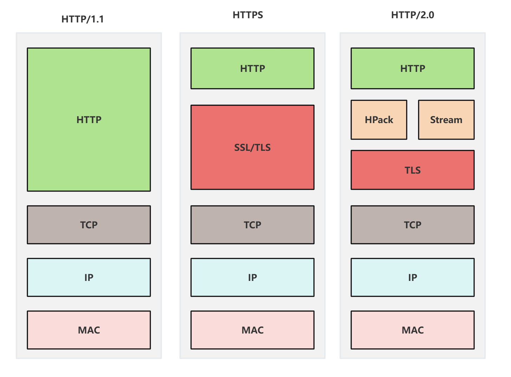

## Table of contents

[link](https://javaguide.cn/cs-basics/network/osi-and-tcp-ip-model.html#osi-%E4%B8%83%E5%B1%82%E6%A8%A1%E5%9E%8B)

[tcp](https://xiaolincoding.com/network/3_tcp/tcp_interview.html)

## 概览


### 基本概念

#### HTTP 是什么

`HyperText transfer protocol` 超文本传输协议

<strong>HTTP 是一个在计算机世界里专门在「两点」之间「传输」文字、图片、音频、视频等「超文本」数据的「约定和规范」。</strong>

#### 常见状态码

具体有 1xx，2xx，3xx，4xx，5xx 五大类状态码；
||含义|举例|
| -- | -- | -- |
|1xx|提示信息，表中间态，还需要后续的操作||
|2xx|成功，报文已接受并正确处理|200，204，206|
|3xx|重定向，资源位置发生变动，需要客户端重新发送请求|301，302，304|
|4xx|客户端错误，请求报文有误，服务器无法处理|400，403，404|
|5xx|服务端错误|500，501，502，503|

- [200 OK]: 成功，非 HEAD 请求的话，服务器的 response 一般带有 body
- [204 no content]: 成功，与 200 相似，response 无 body
- [206 patial content]: 常用于分块下载或者断点续传，response 的 body 并不是资源的全部

---

- [301 move permanently]: 永久重定向，请求的资源已经不存在了，需改用新的 url 重新访问
- [302 Founded]: 临时重定向，说明请求的资源还在，但临时需要另外一个 url 来访问

> 301 和 302 都会在 response header 里使用 location 字段，说明后续要跳转的 url，浏览器会自动跳转

- [304 not modified]: 不具有跳转的含义，标识资源未修改，重定向已存在的缓存文件，也成为缓存重定向，也就是告诉客户端可以即使使用缓存资源, 用户缓存控制

---

- [400 bad request]: 表示 客户端的请求报文有误，但是之歌笼统的错误

- [403 forbidden]: 表示服务器禁止访问资源, 并不是客户端请求出错

- [404 not found]: 表示 请求的资源在服务器上不存在或未找到

---

- [500 internal server error]: 服务端发生错误, 是个笼统的错误码

- [501 not implemented]: 博鳌是客户端请求的功能还不支持，类似 coming soon

- [502 bad gateway]: 服务器作为网关或者代理时返回的错误码, 表示服务器自身工作正常，房后后端发生了错误

- [503 service unavailable]: 表示服务器繁忙, 暂时无法响应客户端

#### 常见字段

- host: 域名
- content-length:服务器在返回数据时，表明本次回应的数据长度，解决粘包问题，HTTP 协议通过设置**换行符，回车符**来作为 http header 的边界，通过 **content-length** 字段作为 http body 的边界，这两个方式都是为了解决[粘包]()问题。

- connection: 客户端要求服务器使用 http 长连接机制，以便其他请求复用，http/1.1 默认的连接都是长连接，为兼容老版的 http，需要制定 connect 值为 keep-alive。 [tcp keepalive vs http keepalive]()

- content-type/accept: 服务器回应客户端本次的数据格式/客户端表情自己可接受哪些数据格式

- content-encoding/accept-encoding: 表示服务器返回数据使用了上面压缩格式/客户端说明自己可以接受哪些压缩方式

### GET / POST

#### 区别

根据 RFC 规范，GET 的语义是从服务器获取指定资源。请求参数一般是写在 URL 中，URL 规定只支持 ASCII，所以 get 请求的参数只允许 ASCII 字符。浏览器会对 URL 长度做限制，本身 http 协议不会对 url 长度做限制

根据 RFC 规范，POST 的语义是根据请求负荷（报文 body）对指定的资源做处理。POST 携带数据的位置一般是写在 报文 body 中，body 的数据格式由客户端与服务端协商，且浏览器不会对 body 大小做限制。

#### GET 和 POST 都是安全和幂等的吗

- 安全：请求方法不会破坏服务器上的资源
- 幂等：多次执行相同的操作，结果都是相同的

所以

- GET 是安全且幂等的
- POST 不是安全的，也不是幂等的

但实际开发过程中，开发者不一定会按照 RFC 规范来实现

### HTTP 特性

常见的 HTTP 版本有 HTTP/1.1，HTTP/2.0，HTTP/3.0

#### HTTP/1.1 优点

1. 简单：HTTP 基本的报文格式就是 <code>header + body</code>，头部信息也是 <code>key-value</code> 简单文本的形式，<strong>易于理解</strong>，降低了学习和使用的门槛。
2. 灵活和易于拓展: HTTP 协议里各类请求方法，URI/URL，状态码，头字段等每个请求都没有被固定死，允许开发人员自定义和补充
   同时，HTTP 工作在应用层（OSI 第七层），所以他的下层可以随意变化，比如：

- HTTPS 就是在 HTTP 和 TCP 之间增加了 SSL/TLS 安全传输层
- HTTP/1.1 和 HTTP/2.0 传输协议用的 TCP 协议，而到了 HTTP/3.0 传输协议改用了 UDP 协议

3. 应用广泛和跨平台

#### HTTP/1.1 缺点

1. 无状态双刃剑：无状态的好处，因为服务器不会去记忆 HTTP 状态，所以不需要额外的资源来记录状态信息，减轻服务器负担；无状态的坏处，既然服务器没有记忆能力，他在完成有关联性的操作时就比较麻烦（Cookie 解决）

2. 明文传输

3. 不安全

#### HTTP/1.1 性能如何

HTTP 协议是基于 TCP/IP ，并且使用了 请求-应答 的通信模式，性能关键在于：

1. 长连接：早期 HTTP/1.0 性能上的一个很大的问题，就是每发起一次请求，都要新建一次 TCP 连接（三次握手），而且是串行请求，增加了通信开销
   为了解决上述问题，HTTP/1.1 提出了长连接，减少额外的连接开销，特点是，只要任意一端没有明确提出断开连接，则保持连接状态

2. 管道网络传输: 在同一个 TCP 连接里，客户端可以发起多个请求，只要第一个请求发出去了，不必等他回来，就可以发第二个请求，减少整体的响应时间；
   但是服务器必须按照接收请求的顺序发送对这些管道化请求的响应，如果服务端处理 A 请求耗时较长，那么后续的请求会被阻塞，这称为 **队头阻塞**；
   所以，HTTP/1.1 管道解决了请求的队头阻塞，没有解决响应的队头阻塞；
   其实这个功能不是默认开启，且浏览器基本没有支持

3. 队头阻塞

### HTTP 缓存

#### 哪些缓存方式

强制缓存和协商缓存

[强缓存和协商缓存](/posts/local-and-conditional-cache)

### HTTP/HTTPS

[详细版](/posts/https-encryption)

### HTTP 演变

#### HTTP/1.1 相比于 HTTP/1.0 提高了什么性能？

改进：

- 使用长连接改善了 HTTP/1.0 短链接造成的性能开销
- 支持管道网络传输，（不常用），只要第一个请求发出去了，不必等其回来，就可发第二个请求。

但，HTTP/1.1 仍有性能瓶颈：

- request/response header 未经压缩，header 越多延迟越大。只能压缩 body。
- 发送冗长的 header。每次互相发送相同的 header 造成浪费。
- 服务器按请求的顺序响应的，依旧存在队头阻塞。
- 没有请求优先级控制。
- 请求只能从客户端开始，服务器只能被动响应。

#### HTTP/2.0 做了哪些优化



HTTP/2.0 是基于 HTTPS 的，所以更有保障

改进：

- 头部压缩
- 二进制格式
- 并发传输
- 服务器主动推动

##### 头部压缩

HTTP/2.0 会压缩 header，如果同时发出多个请求，且头部的一样的或者相似的，协议会帮你消除重复的部分（HPack 算法）

HPack: 客户端和服务器同时维护一张头信息表，所有字段都会存入这个表，生成一个索引号，以后就不发送同样字段的，只发送索引号。通过「静态表、动态表、Huffman 编码」共同完成的

##### 二进制格式

HTTP/2.0 不再像 HTTP/1.1 里的纯文本形式的报文，而是全面采用二进制，头信息和数据体都是二进制，统称为**帧（frame）**，

##### 并发传输

HTTP/2 通过 Stream 这个设计，多个 Stream 复用一条 TCP 连接，达到并发的效果，解决了 HTTP/1.1 队头阻塞的问题，提高了 HTTP 传输的吞吐量。

- 1 个 TCP 连接包含一个或者多个 Stream，Stream 是 HTTP/2 并发的关键技术；
- Stream 里可以包含 1 个或多个 Message，Message 对应 HTTP/1 中的请求或响应，由 HTTP 头部和包体构成；
- Message 里包含一条或者多个 Frame，Frame 是 HTTP/2 最小单位，以二进制压缩格式存放 HTTP/1 中的内容（头部和包体）

在 HTTP/2 连接上，不同 Stream 的帧是可以乱序发送的（因此可以并发不同的 Stream ），因为每个帧的头部会携带 Stream ID 信息，所以接收端可以通过 Stream ID 有序组装成 HTTP 消息，而同一 Stream 内部的帧必须是严格有序的。

客户端和服务器双方都可以建立 Stream，因为服务端可以主动推送资源给客户端， 客户端建立的 Stream 必须是奇数号，而服务器建立的 Stream 必须是偶数号。

同一个连接中的 Stream ID 是不能复用的，只能顺序递增，所以当 Stream ID 耗尽时，需要发一个控制帧 GOAWAY，用来关闭 TCP 连接。

在 Nginx 中，可以通过 http2_max_concurrent_Streams 配置来设置 Stream 的上限，默认是 128 个。

HTTP/2 通过 Stream 实现的并发，比 HTTP/1.1 通过 TCP 连接实现并发要牛逼的多，因为当 HTTP/2 实现 100 个并发 Stream 时，只需要建立一次 TCP 连接，而 HTTP/1.1 需要建立 100 个 TCP 连接，每个 TCP 连接都要经过 TCP 握手、慢启动以及 TLS 握手过程，这些都是很耗时的。

HTTP/2 还可以对每个 Stream 设置不同优先级，帧头中的「标志位」可以设置优先级，比如客户端访问 HTML/CSS 和图片资源时，希望服务器先传递 HTML/CSS，再传图片，那么就可以通过设置 Stream 的优先级来实现，以此提高用户体验。

##### 服务器主动推送

```
location / {
        root /var/www/html;
        index index.html;

        # 服务器推送资源
        http2_push /styles/main.css;
        http2_push /scripts/main.js;
    }
```

#### 总结

第一点，对于常见的 HTTP 头部通过静态表和 Huffman 编码的方式，将体积压缩了近一半，而且针对后续的请求头部，还可以建立动态表，将体积压缩近 90%，大大提高了编码效率，同时节约了带宽资源。

不过，动态表并非可以无限增大， 因为动态表是会占用内存的，动态表越大，内存也越大，容易影响服务器总体的并发能力，因此服务器需要限制 HTTP/2 连接时长或者请求次数。

第二点，HTTP/2 实现了 Stream 并发，多个 Stream 只需复用 1 个 TCP 连接，节约了 TCP 和 TLS 握手时间，以及减少了 TCP 慢启动阶段对流量的影响。不同的 Stream ID 可以并发，即使乱序发送帧也没问题，比如发送 A 请求帧 1 -> B 请求帧 1 -> A 请求帧 2 -> B 请求帧2，但是同一个 Stream 里的帧必须严格有序。

另外，可以根据资源的渲染顺序来设置 Stream 的优先级，从而提高用户体验。

第三点，服务器支持主动推送资源，大大提升了消息的传输性能，服务器推送资源时，会先发送 PUSH_PROMISE 帧，告诉客户端接下来在哪个 Stream 发送资源，然后用偶数号 Stream 发送资源给客户端。

HTTP/2 通过 Stream 的并发能力，解决了 HTTP/1 队头阻塞的问题，看似很完美了，但是 HTTP/2 还是存在“队头阻塞”的问题，只不过问题不是在 HTTP 这一层面，而是在 TCP 这一层。

HTTP/2 是基于 TCP 协议来传输数据的，TCP 是字节流协议，TCP 层必须保证收到的字节数据是完整且连续的，这样内核才会将缓冲区里的数据返回给 HTTP 应用，那么当「前 1 个字节数据」没有到达时，后收到的字节数据只能存放在内核缓冲区里，只有等到这 1 个字节数据到达时，HTTP/2 应用层才能从内核中拿到数据，这就是 HTTP/2 队头阻塞问题。

有没有什么解决方案呢？既然是 TCP 协议自身的问题，那干脆放弃 TCP 协议，转而使用 UDP 协议作为传输层协议，这个大胆的决定，HTTP/3 协议做了！

### HTTP/3.0


