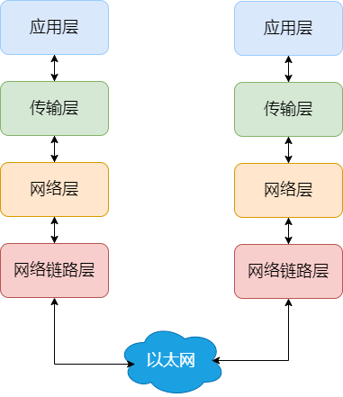

## Table of contents

[link](https://javaguide.cn/cs-basics/network/osi-and-tcp-ip-model.html#osi-%E4%B8%83%E5%B1%82%E6%A8%A1%E5%9E%8B)

[tcp](https://xiaolincoding.com/network/3_tcp/tcp_interview.html)

## 介绍

OSI 和 TCP/IP 网络模型

OSI 的七层体系结构概念清楚，理论也很完整，但是它比较复杂而且不实用，而且有些功能在多个层中重复出现。

TCP/IP 四层模型是目前被广泛采用的一种模型，我们可以将 TCP/IP 模型看作是 OSI 七层模型的精简版本（并不能完全精准匹配），由以下 4 层组成：

## 应用层

**两个终端设备上的应用程序**之间的信息交换，定义了信息交换的格式，消息交给下一层**传输层**

常见的应用层协议有：

- HTTP 主要是为 Web 浏览器与 Web 服务器之间的通信而设计的
- WebSocket 基于 TCP 的全双工通信协议（仅需一次握手），客户端和服务端直接可同时接发
- SMTP/POP3 邮件发送/接收协议
- FTP 基于 TCP 协议，是一种用于在计算机之间传输文件的协议
- RTP 通常基于 UDP 协议，但也支持 TCP 协议。它提供了端到端的实时传输数据的功能
- DNS 基于 UDP 协议，用于解决域名和 IP 地址的映射问题

## 传输层

负责向两台终端设备进程之间的通信提供通用的数据传输服务。是为应用层提供网络支持的。

- TCP（Transmission Control Protocol，传输控制协议）：提供**面向连接**的，**可靠**的数据传输服务。
- UDP（User Datagram Protocol，用户数据协议）：提供**无连接**的，**尽最大努力**的数据传输服务（不保证数据传输的可靠性），简单高效。

## 网络层

应用层和传输层都是端到端的协议，而网络层及以下都是中间件的协议了

主要协议包括：

- IP（Internet Protocol，网际协议），
- ARP（Address Resolution Protocol，地址解析协议），
- ICMP 协议（控制报文协议，用于发送控制消息），
- NAT（Network Address Translation，网络地址转换协议），
- OSPF（Open Shortest Path First，开放式最短路径优先），
- RIP（Routing Information Protocol，路由信息协议，
- BGP（Border Gateway Protocol，边界网关协议）

网络层最常使用的是 IP 协议 (Internet Protocol)，IP 协议会将传输层的报文作为数据部分，再加上 IP 头组装成 IP 报文，如果 IP 报文大小超过 MTU （以太网中一般为 1500 字节）就会再次进行分片，得到个即将发送到网络的 IP 报文。

网络层最重要的五个字：**转发与路由**。

- 转发：将分组从路由器的输入端口转移到合适的输出端口。
- 路由：确定分组从源到目的经过的路径。

## 网络链路层

生成了 IP 头部之后，接下来要交给网络链路层 (Link Layer)，在 IP 头部的前面加上 MAC 头部，并封装成数据帧 (Data frame) 发送到网络上。

以太网就是一种在**局域网**把附近的设备连接起来，使它们之间可以进行通讯的技术。电脑上的以太网接口，Wi-Fi 接口，以太网交换机、路由器上的干兆，万兆以太网口还有网线，它们都是以太网的组成部分

MAC 头部是以太网使用的头部，它包含了接收方和发送方的 MAC 地址等信息，我们可以通过 ARP 协议获取对方的 MAC 地址。

所以说，网络链路层主要为网络层提供**链路级别**传输的服务，负责在以太网、WiFi 这样的底层网络上发送原始数据包，工作在网卡这个层次，使用 MAC 地址来标识网络上的设备。

## 总结

**为啥要分层？**

> 计算机科学领域的任何问题都可以通过增加一个间接的中间层来解决，计算机整个体系从上到下都是按照严格的层次结构设计的
