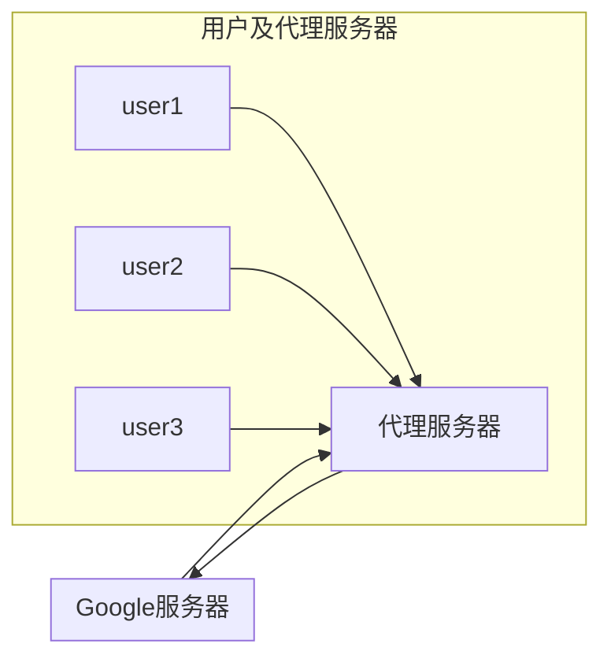
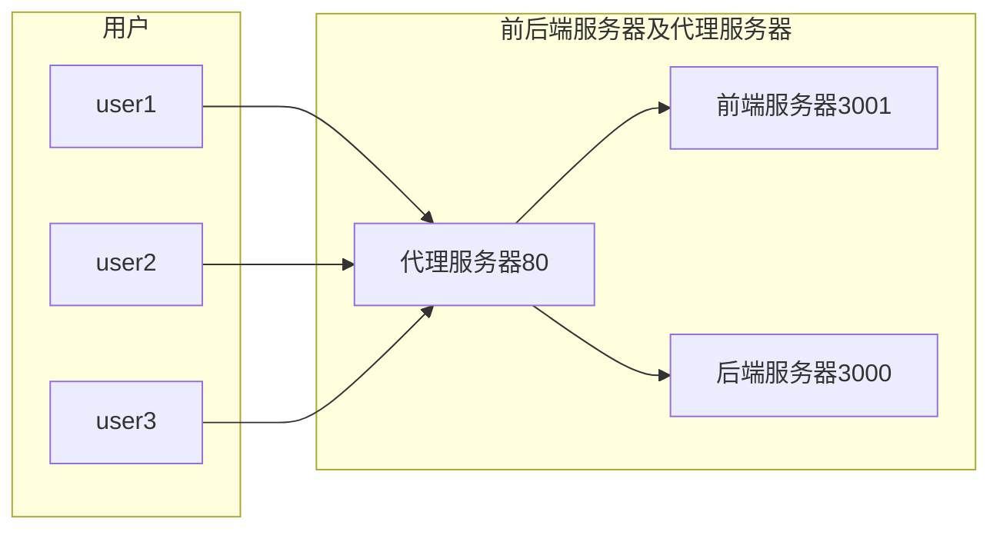
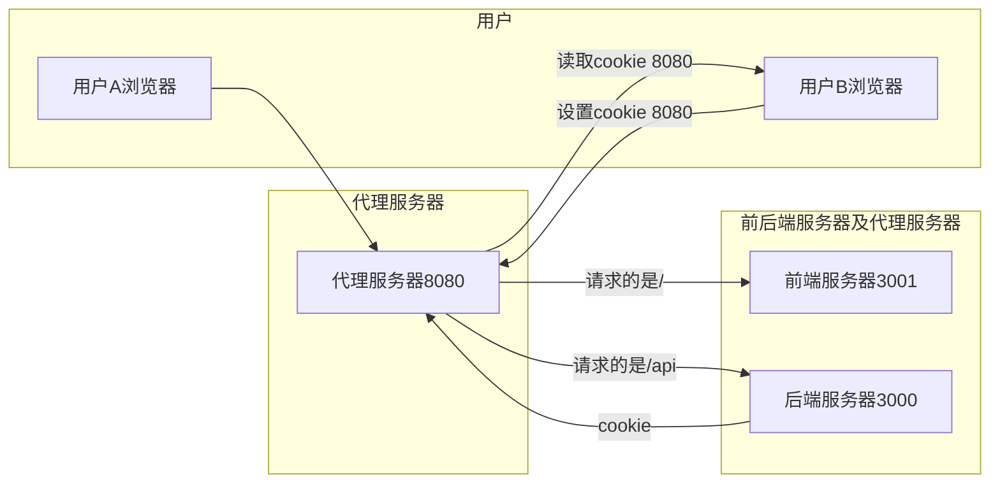

#### cookie 跨域问题

1. Cookie 的跨域问题

   Cookie 是不能跨域使用的, 所以在前后端分离开发的时候, 我们当前的代码就会出现问题

2. 什么是跨域?

   协议/一级域名/二级域名/端口号 有一个不同就是跨域

3. 如何解决前后端分离 Cookie 的跨域问题?

   通过 Nginx 反向代理

   http://nginx.org/en/download.html

#### 正向代理和反向道理

##### 正向代理

1. 代理服务器是为用户服务, 我们称之为正向代理

   例如: 访问谷歌

   用户访问不了谷歌, 但是我可以访问一台海外的服务器, 这台海外服务器又可以访问谷歌

   那么'用户'就可以先访问'海外的服务器', 再通过'海外的服务器'访问谷歌, 这就是正向代理

2. 正向代理的用途

   - 访问原来无法访问的资源，如 google

   - 对客户端访问授权，上网进行认证
   - ... ...



##### 反向代理

1. 反向代理服务器是为'服务器'服务,我们称之为反向代理

2. 反向代理的用途

   - 负载均衡，通过反向代理服务器来优化网站的负载

   - 前后端分离, 统一请求地址



#### nginx 解决 cookie 跨域问题



##### Nginx 安装和使用

1. 安装

   下载解压即可

   http://nginx.org/en/download.html

2. 使用

   修改配置文件

   ```conf
   worker_processes 4; // CPU核数

   http {

       server {

       	listen   8080;

           location / { // 请求根路径代理的地址

            proxy_pass http://192.168.0.107:3001;

           }

           location /api { // 请求/api代理的地址

            proxy_pass http://127.0.0.1:3000;

            proxy_set_header Host $host; // 响应头的地址改成代理的地址

           }
       }
   }

   ```

启动 nginx，访问`http://192.168.0.107:3001/login.html`，再访问`http://127.0.0.1:3000`

再访问`http://127.0.0.1:8080/login.html`

#### PM2

1. 如何上线 Node 编写的项目?

   上线项目需要考虑的几个问题

   - 服务稳定性, 不会因为程序的某个错误或异常导致项目停止服务
   - 线上日志记录, 除了记录访问日志以外, 我们还需要记录错误日志和自定义日志
   - 充分利用服务器资源, Node 是单线程的, 服务器是多核的, 一台服务器只运行一个 Node 程序太浪费资源

2. 如何解决上述问题?

   通过**PM2**

   - PM2 的进程守护可以在程序崩溃后自动重启

   - PM2 自带日志记录的功能, 可以很方便的记录错误日志和自定义日志

   - PM2 能够启动多个 Node 进程, 充分利用服务器资源

##### PM2 基本使用

`npm install pm2 -g`

`pm2 start app.js`

##### PM2 常用指定

```js
pm2 start app.js|config     // 启动应用程序
pm2 list                    // 列出启动的所有的应用程序
pm2 restart appName|appId   // 重启应用程序
pm2 info appName|appId      // 查看应用程序详细信息
pm2 log appName|appId       // 显示指定应用程序的日志
pm2 monit appName|appId     // 监控应用程序
pm2 stop appName|appId      // 停止应用程序
pm2 delete appName|appId    // 关闭并删除所有应用
```

##### PM2 进程守护

PM2 的进程守护可以在程序崩溃后自动重启

##### PM2 常用配置

pm2.conf.json

```json
{
  "apps": {
    "name": "应用程序名称",
    "script": "入口文件名称",
    "watch": true,
    "ignore_watch": ["node_modules", "logs"],
    "error_file": "logs/错误日志文件名称",
    "out_file": "logs/自定义日志文件名称",
    "log_date_format": "yyyy-MM-dd HH:mm:ss"
  }
}
```

通过配置文件来启动`pm2 start pm2.conf.json`

##### PM2 多进程

在配置文件中增加 instances 配置, 想启动几个 Node 进程就写几个

注意点:instances 个数 不能超过服务器 CPU 的核数

```json
{
  "apps": {
    "name": "应用程序名称",
    "script": "入口文件名称",
    "watch": true,
    "ignore_watch": ["node_modules", "logs"],
    "error_file": "logs/错误日志文件名称",
    "out_file": "logs/自定义日志文件名称",
    "log_date_format": "yyyy-MM-dd HH:mm:ss",
    "instances ": 4
  }
}
```
