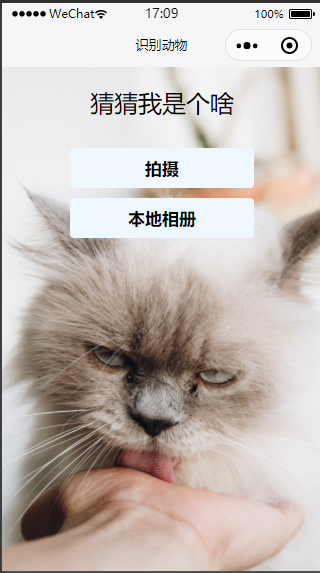
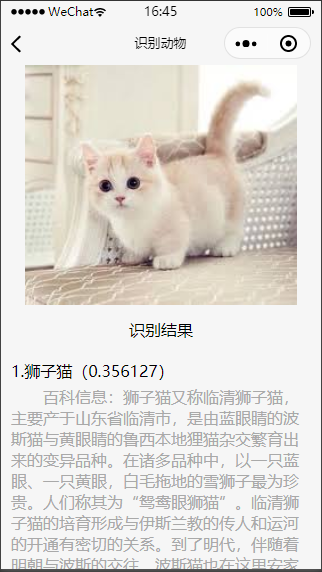

1. 注册小程序个人账号，获取 appid

   https://mp.weixin.qq.com/

2. 微信开发者工具新建项目，后端服务选择**小程序云开发**

   - 初始化后，会提示

     `Error: invalid scope` 没有权限，请先开通云服务

     这时候需要点击左侧 **云开发**，开通云开发。首次开通云环境后，需等待大约 10 分钟方可正常使用云 API，在此期间官方后台服务正在做准备服务，在项目结构目录中`cloudfunctions`后会接上你的云开发环境名称即可视为成功

   - 若提示

     `cloud init error: Error: socket hang up`可无视，可能是网速过慢，刷新重新进入即可

3. 简单构建页面，可选择拍摄上传图片/本地相册上传图片

   ```html
   <view class="container">
     <view class="title-container">
       <text class="title">猜猜我是个啥</text>
     </view>
     <view class="btns">
       <button class="btn" data-Index="0" bindtap="doUpload">拍摄</button>
       <button class="btn" data-Index="1" bindtap="doUpload">本地相册</button>
     </view>
   </view>
   ```

4. 使用`wx.chooseImage`进行图片选择，`wx.cloud.uploadFile`进行图片上传至云存储

   ```js
   wx.chooseImage({
         count:1,
         sizeType: ['original','compressed'],
         sourceType: [sourceType],
         success: function(res) {
           console.log(res)
           let filePath = res.tempFilePaths[0];
             // animal为云开发 存储 中 新建的文件夹名称
           const cloudPath = `animal/${Date.now()}${filePath.match(/\.[^.]+?$/)}`
           console.log(cloudPath);
           wx.cloud.uploadFile({
             cloudPath,
             filePath,
             success:res=>{
               console.log(res)
               wx.navigateTo({
                 url: `../detail/detail?pic=${filePath}&&fileID=${res.fileID}`
               })
             }
           })
         },
       })
     },
   ```

5. 新建 node.js 云函数

   在 cloudfunctions 下新建一个云函数（注意命名必须唯一）,修改 index.js

   - 引入云函数入口文件

     `const cloud = require("wx-server-sdk");`

   - 引入`baidu-aip-sdk`，（使用前先进入此云函数所在目录安装这个包，此处已安装好）

     `var AipImageClassifyClient = require("baidu-aip-sdk").imageClassify;`

   - 设置 APPID/AK/SK

     ```js
     var APP_ID = "your APP_ID";
     var API_KEY = "your API_KEY";
     var SECRET_KEY = "your SECRET_KEY";
     ```

   - 新建一个对象，建议只保存一个对象调用服务接口,并初始化 cloud

     ```js
     var client = new AipImageClassifyClient(APP_ID, API_KEY, SECRET_KEY);

     cloud.init();
     ```

   - 编写云函数入口函数，使用`cloud.downloadFile`下载图片，下载后转为 base64，进而使用`client.animalDetect`进行图像识别，并将结果返回（附加百科词条）

     ```js
     exports.main = async (event, context) => {
       const { fileID } = event;
       //通过fileID取这张图片

       const res = await cloud.downloadFile({
         fileID: fileID,
       });

       const buffer = res.fileContent;
       let image = buffer.toString("base64");

       const info = await client.animalDetect(image, { baike_num: 5 });

       return {
         info,
       };
     };
     ```

##### 一坑

**注意：写好的云函数记得右击上传并部署**

6. 识别结果页面

   ```html
   <view wx:if="{{imgUrl}}">
     <image src="{{imgUrl}}" mode="aspectFit"></image>
   </view>
   <view class="title-container">
     <text class="title">识别结果</text>
   </view>
   <view wx:for="{{result}}" class="list">
     <view class="list-name">{{index+1}}.{{item.name}}（{{item.score}}）</view>
     <view class="list-baike"
       >百科信息：{{item.baike_info.description || '暂无'}}</view
     >
   </view>
   ```

7. 识别页面的入口函数

   在文件中使用`wx.cloud.callFunction`调用云函数

   ```js
   onLoad: function (options) {
       let { pic, fileID } = options;
       this.setData({
         imgUrl:pic
       })

       wx.cloud.callFunction({
         name:"baidu2",
         data:{
           fileID: fileID
         },
         success:res=>{
           console.log(res,"baidu")
           const {result:{info:{result}}} = res
           this.setData({
             result:result
           })
         }
       })
     },
   ```

github 地址:https://github.com/xxn-my/applet-cloud

效果图：





##### 二坑

在微信开发者工具打开终端执行 npm install 出现以下的提示

**无法加载文件 C:\Users\lulei\AppData\Roaming\npm\cnpm.ps1，因为在此系统上禁止运行脚本”的问题**

解决方案

打开 Windows PowerShell，选择“以管理员身份运行”，输入`set-ExecutionPolicy RemoteSigned`，然后更改权限为 A 即可
